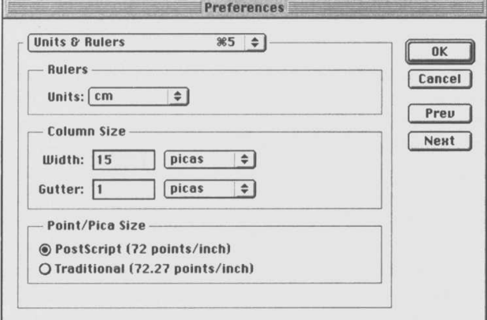
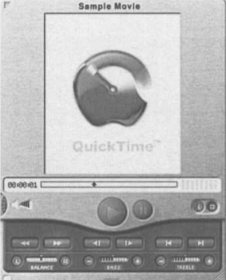

# Digital multimedia

## introduction
---------------

**A storyteller might use these portentous words to capture your attention and draw you into a tale. A novelist might use the same words to begin the first page of a book. A radio play based on the same story could open with a crash of thunder and the howling of the wind. A film of the book could open on a scene of darkness, suddenly illuminated by a flash of lightning that reveals trees bent over in the gale.**

_Seorang pendongeng mungkin menggunakan kata-kata indah ini untuk menangkap Anda perhatian dan menarik Anda ke dalam sebuah cerita. Seorang novelis mungkin menggunakan hal yang sama kata-kata untuk memulai halaman pertama sebuah buku. Drama radio berdasarkan cerita yang sama bisa dibuka dengan gemuruh guntur dan lolongan angin. Sebuah film dari buku itu bisa terbuka di adegan kegelapan, tiba-tiba diterangi oleh kilatan petir yang memperlihatkan pohon-pohon membungkuk di tengah badai._

**The dark and stormy night can be represented in different media, each of which tells the story through different means, appealing to different senses. One of the key insights in computing is that all these media can be represented digitally, as a structured collection of bits, and can then be manipulated by programs on a computer, stored on disks and other storage devices, and transmitted over networks. Their shared digital representation means that different media can be combined into what is loosely called multimedia**

_Itu adalah malam yang gelap dan penuh badai. Seorang pendongeng mungkin menggunakan kata-kata indah ini untuk menangkap Anda perhatian dan menarik Anda ke dalam sebuah cerita. Seorang novelis mungkin menggunakan hal yang sama kata-kata untuk memulai halaman pertama sebuah buku. Drama radio berdasarkan cerita yang sama bisa dibuka dengan gemuruh guntur dan lolongan angin. Sebuah film dari buku itu bisa terbuka di adegan kegelapan, tiba-tiba diterangi oleh kilatan petir yang mengungkapkan pohon bengkok di atas angin kencang_

**The combination of different media is not something new. On the contrary, established forms mix media routinely. A TV news bulletin, for example, might include sound and moving pictures — both live and recorded — still images, such as photographs of politicians, graphic illustrations, such as a histogram showing the trend in unemployment, and text, in the form of subtitles, captions, quotations, and credits, which will usually be accompanied by suitable annunciatory music. A contemporary live theatrical performance may incorporate two- or three-dimensional artwork and design (sets, backdrops, costumes), sound, which may be a mixture of speech and live music, perhaps with tape recordings and synthesized sounds, projected still and moving images, and sometimes text in the form of surtitles (written text displayed above the stage, which are often used for translation, especially in opera).**

_Kombinasi media yang berbeda bukanlah sesuatu yang baru. Sebaliknya, bentuk-bentuk mapan mencampur media secara rutin. Buletin berita TV, misalnya, mungkin menyertakan suara dan gambar bergerak baik langsung maupun rekaman gambar diam, seperti foto politisi, ilustrasi grafis, seperti histogram yang menunjukkan tren pengangguran, dan teks, dalam bentuk sub judul, keterangan, kutipan, dan kredit, yang biasanya disertai dengan musik peringatan yang sesuai. Pertunjukan teater langsung kontemporer dapat menggabungkan karya seni dan desain dua atau tiga dimensi (set, latar belakang, kostum), suara, yang mungkin merupakan campuran pidato dan musik langsung, mungkin dengan rekaman kaset dan suara yang disintesis, gambar diam dan gambar bergerak yang diproyeksikan. , dan terkadang teks dalam bentuk surtitle (teks tertulis yang ditampilkan di atas panggung, yang sering digunakan untuk terjemahan, terutama dalam opera)._

**The integration of media is natural — we perceive the world through all the senses we have at once; the separation of media is artificial, and may often seem unsatisfactory.**

_Integrasi media itu alami — kita melihat dunia melalui semua indera yang kita miliki sekaligus pemisahan media adalah buatan, dan mungkin sering tampak tidak memuaskan._

**Consider film, for example. From the earliest days of cinema, in the absence of any method of recording and playing sound in synchronization with picture, separate live sounds were produced at the same time as the film was shown: not just the live piano accompaniment that you may find in contemporary art-house cinema showings of silent classics, but dialogue, singing, and sound effects, produced by actors, singers, and noisemakers in the theatre, often hidden behind the screen. So great was the film-going public's desire to hear sound naturally integrated with moving pictures that in 1927 when Al Jolson spoke his phrase, 'Wait a minute, wait a minute. You ain't heard nothing yet,' in The Jazz Singer, audiences stood up and cheered. It is hardly surprising, then, that once the technical obstacles to representing media digitally (which we will consider in Chapter 2) were overcome, the next step should be to combine separate media. In fact, the separation of digital media into distinct data types — different 'sorts of things' to which different operations can be applied — can be seen as a temporary exigency demanded by an immature technology.**

_Pertimbangkan film, misalnya. Dari hari-hari awal bioskop, jika tidak ada metode untuk merekam dan memutar suara di sinkronisasi dengan gambar, suara langsung yang terpisah dihasilkan bersamaan dengan pemutaran film: bukan hanya piano live iringan yang mungkin Anda temukan di rumah seni kontemporer pertunjukan bioskop klasik bisu, tetapi dialog, nyanyian, dan suara efek, yang diproduksi oleh aktor, penyanyi, dan pembuat kebisingan di teater, sering tersembunyi di balik layar. Begitu hebatnya film-going public keinginan untuk mendengar suara yang terintegrasi secara alami dengan gambar bergerak yang pada tahun 1927 ketika Al Jolson mengucapkan kalimatnya, 'Tunggu sebentar, tunggu sebentar. Anda belum mendengar apa-apa,' di The Jazz Singer, penonton berdiri dan bersorak. Maka, tidak mengherankan bahwa sekali hambatan teknis untuk mewakili media secara digital (yang akan kami pertimbangkan dalam Bab 2) diatasi, langkah selanjutnya adalah untuk menggabungkan media yang terpisah. Bahkan, pemisahan media digital menjadi tipe data yang berbeda 'jenis hal' yang berbeda yang berbeda operasi dapat diterapkan — dapat dilihat sebagai urgensi sementara dituntut oleh teknologi yang belum matang._

### Aplication of Multimedia
----------------------------

**What is it, then, if not the combination of media, that distinguishes digital multimedia from previous forms of combined media? It is the fact that the bits that represent text, sound, pictures, and so on can be treated as data by computer programs. The full potential of this fact has not yet been fully explored, but one facet of it immediately distinguishes digital multimedia from its predecessors. A program can control the order in which various components are presented and combined, and can do so in response to input**

_Jika bukan kombinasi media, apa yang membedakan multimedia digital dari bentuk media gabungan sebelumnya? Ini adalah fakta bahwa bit yang mewakili teks, suara, gambar, dan sebagainya dapat diperlakukan sebagai data oleh program komputer. Potensi penuh dari fakta ini belum sepenuhnya dieksplorasi, tetapi satu sisi langsung membedakan multimedia digital dari pendahulunya. Sebuah program dapat mengontrol urutan di mana berbagai komponen disajikan dan digabungkan, dan dapat melakukannya sebagai respons terhadap input dari pengguna komputer. Dengan kata lain, multimedia digital dapat interaktif, dengan cara, misalnya, buletin berita TV tidak, dan itu jauh melampaui kontrol sederhana yang diberikan oleh VCR._

**The digital multimedia version of the story we began this book with could open with a picture depicting a dark and stormy night. By clicking on an icon on the screen, the user could cause the scene to play as a video clip, or add sound effects, according to their choice. Perhaps by clicking on different areas of the scene, details could be revealed, or a new scene could be introduced — a different one for each part of the first scene, allowing the tangled tale of betrayal and redemption that began on that dark stormy night to unfold in more than one way, told through the eyes of different characters. Users whose hearing was poor could choose to have a transcription of any dialogue displayed for them, while users with impaired vision could have a description of what was happening 'read' to them by their computer. Different interface options might be offered for users with different tastes and needs. If the story had attracted critical attention, it might be possible to bring up learned commentaries on particular aspects, or a history of its telling in different media. There might be an opportunity for the user to take an active role,change the story, add new elements or recombine the existing ones.**

_Versi multimedia digital dari cerita kami memulai buku ini denganbisa dibuka dengan gambar yang menggambarkan malam yang gelap dan penuh badai. Oleh mengklik ikon di layar, pengguna dapat menyebabkan adegan menjadi bermain sebagai klip video, atau menambahkan efek suara, sesuai pilihan mereka. Mungkin dengan mengklik area yang berbeda dari pemandangan, detailnya bisa terungkap, atau adegan baru dapat diperkenalkan — yang berbeda untuk setiap bagian dari adegan pertama, memungkinkan kisah pengkhianatan yang kusut dan penebusan yang dimulai pada malam badai yang gelap itu akan terungkap lebih banyak lagi dari satu cara, diceritakan melalui mata karakter yang berbeda. Pengguna yang pendengarannya buruk dapat memilih untuk memiliki transkripsi apa pun dialog ditampilkan untuk mereka, sementara pengguna dengan gangguan penglihatan bisa memiliki deskripsi tentang apa yang terjadi 'baca' kepada mereka oleh mereka komputer. Opsi antarmuka yang berbeda mungkin ditawarkan untuk pengguna dengan selera dan kebutuhan yang berbeda. Jika ceritanya menarik kritik perhatian, dimungkinkan untuk memunculkan komentar-komentar terpelajar pada aspek-aspek tertentu, atau sejarah penceritaannya di berbagai media. Mungkin ada kesempatan bagi pengguna untuk mengambil peran aktif,ubah cerita, tambahkan elemen baru, atau gabungkan kembali elemen yang sudah ada._

**Suppose, though, that this is not just a story — that some crime was committed on a real dark and stormy night, and that somebody had subsequently been arrested and charged with an offence. By collating evidence from witnesses, and facts about the location, the events of the night could be reconstructed and presented, like our story, as a mixture of animation, graphics, sound and video, with textual annotations. Members of the jury could then examine the event from different angles, verify that it was possible to see something at a certain distance, perhaps factor out the parts of the reconstruction based on a certain witness's evidence, or try out various hypotheses suggested by the lawyers in the case. Forensic multimedia of this sort is already being used in courts in the United States.**

_Namun, anggaplah ini bukan hanya sebuah cerita — bahwa beberapa kejahatan dilakukan pada malam yang benar-benar gelap dan penuh badai, dan seseorang itu kemudian ditangkap dan didakwa melakukan pelanggaran. Oleh mengumpulkan bukti dari saksi, dan fakta tentang lokasi, peristiwa malam itu dapat direkonstruksi dan disajikan, seperti cerita kami, sebagai campuran animasi, grafik, suara dan video, dengan anotasi tekstual. Anggota juri kemudian dapat memeriksa acara dari sudut yang berbeda, verifikasi bahwa itu mungkin untuk dilihat sesuatu pada jarak tertentu, mungkin memperhitungkan bagian-bagian dari rekonstruksi berdasarkan keterangan saksi tertentu, atau try out berbagai hipotesis yang diajukan oleh para pengacara dalam kasus tersebut. Forensik multimedia semacam ini sudah digunakan di pengadilan di Amerika Serikat._

**Digital multimedia may be used for many things besides storiesand forensic reconstructions. The most prominent and economically significant uses of multimedia at present are in the fields of entertainment and education. At one extreme, the combination of sound, animation, video and text with interactivity is commonly found both in adventure games, such as Starship Titanic and action games, such as Doom and its bloody offspring. At the opposite extreme are the multimedia reference works, such as the Cinemania cinema encyclopedia, or the digital versions of the Encyclopedia Britannica.**

_Multimedia digital dapat digunakan untuk banyak hal selain cerita dan rekonstruksi forensik. Yang paling menonjol dan ekonomis penggunaan signifikan dari multimedia saat ini adalah di bidang hiburan dan pendidikan. Pada satu ekstrim, kombinasi suara, animasi, video dan teks dengan interaktivitas umumnya ditemukan baik di game petualangan, seperti Starship Titanic dan aksi game, seperti Doom dan keturunannya yang berdarah. Pada ekstrem yang berlawanan adalah karya referensi multimedia, seperti Cinemania ensiklopedia bioskop, atau versi digital dari Ensiklopedia Britannia._

**Multimedia is also being used educationally in schools, and for extra-curricular and pre-school learning, where multimedia teaching materials can be used to present information in more direct ways than traditional books and lessons. For example, film clips and original recordings of radio broadcasts can be integrated with a textual account of events leading up to the Second World War in a modern history lesson. Virtual science experiments can be constructed using multimedia techniques, to allow pupils to work with simulations of equipment that is not available to them. In both these cases, interactive features allow pupils to work at their own pace, or to pursue specialized aspects of a project according to their particular interests. Multimedia teaching materials can be bought in as complete CD-ROM titles, or they can be made by teachers in their own schools. Children themselves can also make multimedia, in the form of project reports, or as an end in itself, as an electronic class book or newsletter.**

_Multimedia juga digunakan untuk pendidikan di sekolah, dan untuk pembelajaran ekstra kurikuler dan pra-sekolah, di mana pengajaran multimedia materi dapat digunakan untuk menyajikan informasi dengan cara yang lebih langsung daripada buku dan pelajaran tradisional. Misalnya, klip film dan rekaman asli siaran radio dapat diintegrasikan dengan a catatan tekstual tentang peristiwa yang mengarah ke Perang Dunia Kedua dalam pelajaran sejarah modern. Eksperimen sains virtual bisa menjadi dibangun menggunakan teknik multimedia, untuk memungkinkan siswa untuk bekerja dengan simulasi peralatan yang tidak tersedia bagi mereka. di keduanya kasus ini, fitur interaktif memungkinkan siswa untuk bekerja sendiri kecepatan, atau untuk mengejar aspek-aspek khusus dari suatu proyek sesuai dengan kepentingan tertentu. Bahan ajar multimedia dapat dibeli di sebagai judul CD-ROM lengkap, atau dapat dibuat oleh guru di sekolah sendiri. Anak-anak sendiri juga bisa membuat multimedia, di bentuk laporan proyek, atau sebagai tujuan itu sendiri, sebagai kelas elektronik buku atau buletin._

**The distinction between education and entertainment is not a clear one; several succesful multimedia CD-ROMs use elements of games for an educational purpose. For example, The Logical Journey of the Zoombinis develops children's problem-solving skills through a series of puzzles, organized in the form of a game. This approach to learning seems to be popular for very young children, with a range of titles available for teaching literacy and basic mathematics. These are aimed both at schools and at parents, for use in the home. (As a side-effect, the use of such materials also teaches computer skills from an early age.)**

_Perbedaan antara pendidikan dan hiburan tidak jelas satu; beberapa CD-ROM multimedia yang sukses menggunakan elemen permainan untuk tujuan pendidikan. Misalnya, Perjalanan Logis dari Zoombinis mengembangkan keterampilan pemecahan masalah anak-anak melalui a serangkaian teka-teki, disusun dalam bentuk permainan. Pendekatan ini untuk pembelajaran tampaknya populer untuk anak-anak yang sangat muda, dengan jangkauan judul yang tersedia untuk mengajar literasi dan matematika dasar. Ini ditujukan untuk sekolah dan orang tua, untuk digunakan di rumah. (Sebagai efek sampingnya, penggunaan materi semacam itu juga mengajarkan keterampilan komputer sejak usia dini.)_

**In contrast to the entertainment and education sectors, where most multimedia is professionally produced and marketed, much of the material used in business is produced for a specific company, oftenin-house. In a continuation of the use of multimedia in formal education,multimedia materials are used for training. As with the virtual science experiments in schools, multimedia can be used to produce interactive simulations of equipment and procedures, in cases where it would be expensive or hazardous to use the real thing for training. Multimedia is also used in sales presentations and promotions — for example, computers on sale in showrooms often run multimedia presentations describing their capabilities, and Web pages often function as sales brochures.**

_Berbeda dengan sektor hiburan dan pendidikan, di mana sebagian besar multimedia diproduksi dan dipasarkan secara profesional, sebagian besar bahan yang digunakan dalam bisnis diproduksi untuk perusahaan tertentu, seringkali di rumah. Sebagai kelanjutan dari penggunaan multimedia secara formal pendidikan, materi multimedia digunakan untuk pelatihan. Seperti halnya eksperimen sains virtual di sekolah, multimedia dapat digunakan untuk menghasilkan simulasi interaktif dari peralatan dan prosedur, dalam kasus di mana akan mahal atau berbahaya untuk menggunakan yang asli untuk latihan. Multimedia juga digunakan dalam presentasi penjualan dan promosi misalnya, komputer sering dijual di ruang pamer menjalankan presentasi multimedia yang menjelaskan kemampuannya, dan Web halaman sering berfungsi sebagai brosur penjualan._

**Some professions and business areas lend themselves especially well to multimedia. Graphic designers produce interactive presentations of their work as a supplement to, or even as a substitute for, a conventional portfolio. The electronic portfolio can be inexpensively duplicated on CD-ROM and sent to potential clients, or posted on a Web site as a virtual exhibition. In the shrinkwrapped software business, paper manuals have been gradually giving way to electronic documentation for some years. The move from hard copy to digital formats has provided an opportunity to augment the text and diagrams of conventional manuals with animations, video clips, and sound. Many programs now come with a multimedia product tour demonstrating their best features, and interactive tutorials, which guide novice users through simple tasks.**

_Beberapa profesi dan bidang bisnis sangat cocok untuk diri mereka sendiri baik untuk multimedia. Desainer grafis menghasilkan presentasi interaktif dari pekerjaan mereka sebagai pelengkap, atau bahkan sebagai pengganti untuk, portofolio konvensional. Portofolio elektronik dapat berupa murah digandakan pada CD-ROM dan dikirim ke klien potensial, atau diposting di situs Web sebagai pameran virtual. Dalam bisnis perangkat lunak yang dibungkus menyusut, manual kertas telah secara bertahap memberi jalan kepada dokumentasi elektronik selama beberapa tahun. Gerakan dari hard copy ke format digital telah memberikan kesempatan untuk menambah teks dan diagram manual konvensional dengan animasi, klip video, dan suara. Banyak program sekarang hadir dengan tur produk multimedia, mendemonstrasikan fitur terbaik mereka, dan tutorial interaktif, yang memandu pengguna pemula melalui tugas-tugas sederhana._

**One area in which computation plays a more active part is visualization, in which graphics and animation are used as a means of presenting complex data. Banal examples of visualizations include pie-charts and bar-charts being generated from spreadsheet data: their graphical form summarizes the data in a way that makes recognition of trends and comparisons between magnitudes possible at a glance. More complex data than the sort normally kept in spreadsheets demands more complex visualizations to provide the same degree of comprehensibility Three-dimensional and timevarying presentations, making use of false colour to carry extra information, are often favoured. Such elaborate visualizations are frequently generated from simulations of complex dynamic systems: for example, a program that simulates atmospheric dynamics may generate a time-lapse movie of the gestation of a tropical storm; a program simulating an organic chemical reaction may generate a three-dimensional model of the structure of the molecules involved, showing the changes they undergo. As these examples show, visualization is widely used by scientists; it is also used in business, where the systems being tracked or simulated are financial, and the output is correspondingly more abstract.**

_Satu area di mana komputasi memainkan peran yang lebih aktif adalah visualisasi, di mana grafik dan animasi digunakan sebagai sarana untuk menyajikan data yang kompleks. Contoh visualisasi yang dangkal termasuk diagram lingkaran dan diagram batang yang dihasilkan dari spreadsheet data: bentuk grafiknya merangkum data dengan cara yang membuat pengakuan tren dan perbandingan antara besaran mungkin secara sekilas. Data yang lebih kompleks daripada jenis yang biasanya disimpan dalam spreadsheet menuntut visualisasi yang lebih kompleks untuk disediakantingkat pemahaman yang sama. Presentasi tiga dimensi dan waktu yang bervariasi, memanfaatkan warna palsu untuk membawa ekstra informasi, sering disukai. Visualisasi yang begitu rumit sering dihasilkan dari simulasi dinamika kompleks sistem: misalnya, program yang mensimulasikan atmosfer dinamika dapat menghasilkan film selang waktu kehamilan a badai tropis; sebuah program yang mensimulasikan reaksi kimia organik dapat menghasilkan model tiga dimensi dari struktur molekul yang terlibat, menunjukkan perubahan yang mereka alami. Seperti ini contoh menunjukkan, visualisasi banyak digunakan oleh para ilmuwan; itu juga digunakan dalam bisnis, di mana sistem yang dilacak atau disimulasikan finansial, dan hasilnya juga lebih abstrak._

**The established entertainment industry, while still delivering an essentially linear and non-interactive product, now makes extensive use of digital multimedia technology in the production of everything from blockbuster movies to gardening programmes on TV. The use of connections with digitally delivered material, such as links between programming and supporting Web sites, or accompanying CD-ROMs for mainstream movies, is rapidly expanding. At the same time, a rapidly increasing number of festivals, conferences and other international events are providing showcases for "new media" at all levels from the artistic avant garde to the purely commercial.**

_Industri hiburan yang mapan, sambil tetap memberikan produk dasarnya linier dan non-interaktif, sekarang membuat ekstensif penggunaan teknologi multimedia digital dalam produksi segalanya dari film blockbuster hingga program berkebun di TV. Itu penggunaan koneksi dengan materi yang dikirimkan secara digital, seperti tautan antara pemrograman dan situs Web pendukung, atau yang menyertai CD-ROM untuk film mainstream, berkembang pesat. Pada pada saat yang sama, jumlah festival, konferensi, dan acara internasional lainnya yang meningkat pesat menyediakan pameran untuk "media baru" di semua tingkatan dari avant garde artistik hingga komersial murni._

### Delivery of Multimedia
--------------------------

**The applications we have mentioned so far are all basically concerned with presenting material, using a combination of media, in an interactive way. Some means of delivery is required, to get this material from its producer to its consumers. It is useful to distinguish between online and offline delivery.**

_Aplikasi yang telah kami sebutkan selama ini pada dasarnya berkaitan dengan penyajian materi, menggunakan kombinasi media, secara interaktif Beberapa cara pengiriman diperlukan, untuk mendapatkan bahan ini dari produsen ke konsumennya. Hal ini berguna untuk membedakan antara pengiriman online dan offline._

**Online delivery uses a network to send information from one computer, often a server machine providing centralized storage of bulky data, to another, usually a personal computer on somebody's desk. The network in question may be a local area network serving a single organization, but more often it will be the Internet. In particular, the World Wide Web has established itself as a popular means of delivering multimedia online.**

_Pengiriman online menggunakan jaringan untuk mengirim informasi dari satu komputer, seringkali mesin server yang menyediakan penyimpanan terpusat dari data besar, ke komputer lain, biasanya komputer pribadi di meja seseorang. Jaringan yang dimaksud mungkin merupakan jaringan area lokal yang melayani satu organisasi, tetapi yang lebih sering adalah Internet. Secara khusus, World Wide Web telah memantapkan dirinya sebagai sarana populer untuk menyampaikan multimedia online_

    The World Wide Web has achieved such supremacy as a means of accessing data over the Internet that in popular perception the Web and the net are sometimes seen as synonymous. This is not the case, as we will explain in Chapter 2, and in more detail in Chapter 15.

    World Wide Web telah mencapai supremasi sebagai sarana untuk mengakses data melalui Internet yang dalam persepsi populer Web dan internet kadang-kadang dilihat sebagai sinonim. Hal ini tidak terjadi, seperti yang akan kami jelaskan di Bab 2, dan secara lebih rinci di Bab 15.

**Where multimedia is delivered offline, some removable storage medium must be used. The widespread deployment of CD-ROM drives in personal computers in the mid-1990s was, to some extent, responsible for the surge in interest in multimedia at that time. This is because, for the first time, it made available a form of storage with adequate capacity (around 650 Mbytes, compared to the 1.44 Mbytes of floppy disks) to accommodate the large files characteristic of multimedia data, while still being relatively inexpensive to duplicate. The data transfer rate of early CD-ROM drives was too slow to support playback of video and sound, but more recent models have increased the speed, to the point where multimedia can be played directly from a CD-ROM, although smooth playback of full-screen video from CD-ROM is still impossible without additional hardware support.**

_Dimana multimedia disampaikan secara offline, beberapa media penyimpanan yang dapat dipindahkan harus digunakan. Penyebaran luas drive CD-ROM di komputer pribadi pada pertengahan 1990-an, sampai batas tertentu, bertanggung jawab atas lonjakan minat multimedia pada waktu itu. Hal ini karena, untuk pertama kalinya, tersedia bentuk penyimpanan dengan kapasitas yang memadai (sekitar 650 Mbytes, dibandingkan dengan 1,44 Mbytes floppy disk) untuk menampung file-file besar yang menjadi ciri data multimedia, sementara masih relatif murah untuk digandakan. . Kecepatan transfer data drive CD-ROM awal terlalu lambat untuk mendukung pemutaran video dan suara, tetapi model yang lebih baru telah meningkatkan kecepatan, ke titik di mana multimedia dapat diputar langsung dari CD-ROM, meskipun pemutaran penuh lancar. -Video layar dari CD-ROM masih tidak mungkin tanpa dukungan perangkat keras tambahan._

**While online delivery is widely seen as the future for multimedia, the low bandwidth available for most domestic connections to the Internet means that, especially for large and elaborate work, offline delivery on CD-ROM remains popular. There is an increasing trend towards a combination of offline and online delivery, with CD ROMs being used to hold a fixed collection of data, augmented withlinks to Web sites, where updates and supporting information are available (sometimes for a supplementary fee).**

_Sementara pengiriman online secara luas dilihat sebagai masa depan untuk multimedia, bandwidth rendah yang tersedia untuk sebagian besar koneksi domestik ke Internet berarti bahwa, terutama untuk pekerjaan besar dan rumit, pengiriman offline pada CD-ROM tetap populer. Ada kecenderungan yang meningkat menuju kombinasi pengiriman offline dan online, dengan CD ROM digunakan untuk menyimpan koleksi data tetap, ditambah dengan tautan ke situs Web, di mana pembaruan dan informasi pendukung tersedia (kadang-kadang dengan biaya tambahan)._

**In 1995, an industry consortium announced the specification for a successor to CD-ROM, using the same size and shape platters, called DVD. Originally, this stood for Digital Video Disk, since the format was intended as a replacement for VHS cassettes as a distribution medium for video, as analogue methods of storing video began to be replaced by digital methods. It was immediately understood that DVD could be used equally well for any digital data, just as the audio Compact Disc had been adapted as the CD-ROM. Accordingly, the name was changed, somewhat desperately, to Digital Versatile Disk, thus keeping the abbreviation DVD. DVD offers a much higher storage capacity (up to 17 Gbytes on a double-sided disk), with similar transfer rates to modern (12x and higher) CD-ROM drives. Despite considerable media enthusiasm for DVD, it has not been taken up as rapidly as originally predicted, but during 1999, an increasing number of personal computers were being shipped with DVD drives fitted. Since these drives can also read CD-ROMs, itseems likely that they will become standard peripherals, and that DVD will be used to deliver multimedia, especially high quality video.**

_Pada tahun 1995, sebuah konsorsium industri mengumumkan spesifikasi untuk penerus CD-ROM, menggunakan piringan ukuran dan bentuk yang sama, yang disebut DVD. Awalnya, ini adalah singkatan dari Digital Video Disk, karena formatnya dimaksudkan sebagai pengganti kaset VHS sebagai media distribusi video, karena metode penyimpanan video analog mulai digantikan oleh metode digital. Segera dipahami bahwa DVD dapat digunakan dengan baik untuk data digital apa pun, seperti halnya Compact Disc audio yang telah diadaptasi sebagai CD-ROM. Oleh karena itu, namanya diubah, agak putus asa, menjadi Digital Versatile Disk, dengan demikian mempertahankan singkatan DVD. DVD menawarkan kapasitas penyimpanan yang jauh lebih tinggi (hingga 17 Gbyte pada disk dua sisi), dengan kecepatan transfer yang sama dengan drive CD-ROM modern (12x dan lebih tinggi). Meskipun antusiasme media yang cukup besar untuk DVD, itu belum diambil secepat yang diperkirakan semula, tetapi selama tahun 1999, semakin banyak komputer pribadi yang dikirimkan dengan drive DVD yang dipasang. Karena drive ini juga dapat membaca CD-ROM, tampaknya drive ini akan menjadi periferal standar, dan DVD tersebut akan digunakan untuk mengirimkan multimedia, terutama video berkualitas tinggi._

**Online delivery, however, offers possibilities which are not available offline. In particular, it enables the delivery of (almost) live multimedia content, which in turn makes possible novel applications such as video conferencing and broadcast multimedia. Generally, when multimedia is delivered online, the delivery need not be passive, in the way that it is from CD-ROM: things can happen at the delivering end; for example, a database query can be executed.**

_Pengiriman online, bagaimanapun, menawarkan kemungkinan yang tidak tersedia secara offline. Secara khusus, ini memungkinkan pengiriman (hampir) konten multimedia langsung, yang pada gilirannya memungkinkan aplikasi baru seperti konferensi video dan multimedia siaran. Umumnya, ketika multimedia disampaikan secara online, pengiriman tidak perlu pasif, seperti dari CD-ROM: hal-hal dapat terjadi pada akhir pengiriman; misalnya, kueri basis data dapat dieksekusi._

### Historial Context
----------------------

**Compared with established forms such as film or the novel, multimedia is still in its earliest days. The CD-ROM specification was published in 1985, with drives appearing on desktop machines from about 1989; the World Wide Web became publicly available outside CERN at the start of 1992, in the form of a line-based browser giving access to a handful of servers; by January 1997, when the HTML 3.2 specification was adopted as a World Wide Web Consortium Recommendation, audio and video were only supported in Web pages through the use of proprietary extensions. We have become so accustomed to the high speed of technological change in computing that multimedia is already seen as an established feature of the computing landscape. But, on the time-scale of cultural change, it has barely arrived.**

_Dibandingkan dengan bentuk-bentuk mapan seperti film atau novel, multimedia masih dalam masa awal. Spesifikasi CD-ROM diterbitkan pada tahun 1985, dengan drive yang muncul pada mesin desktop dari sekitar tahun 1989; World Wide Web menjadi tersedia untuk umum di luar CERN pada awal tahun 1992, dalam bentuk browser berbasis garis yang memberikan akses ke beberapa server; pada Januari 1997, ketika spesifikasi HTML 3.2 diadopsi sebagai Rekomendasi Konsorsium World Wide Web, audio dan video hanya didukung di halaman Web melalui penggunaan ekstensi eksklusif. Kita telah menjadi begitu terbiasa dengan kecepatan tinggi perubahan teknologi dalam komputasi sehingga multimedia sudah dilihat sebagai fitur mapan dari lanskap komputasi. Tapi, pada skala waktu perubahan budaya, itu baru saja tiba._

**The history of film and animation, for example, demonstrates that it takes time — much longer than digital multimedia has existed — for conventions about content and consumption to become established. The very first films exhibited to the public, by the Lumiere brothers at the Grand Cafe on the Boulevard des Capucines, in Paris in 1895, showed such subjects as workers going home from a factory, and a train arriving at a station. To be able to reproduce movement was enough, without the farrago of plot, character, or message we normally associate with films. The early trick films of Georges Melies were shown as part of his magic show, in the same way as the magic lantern projections he used to create illusions. In a similar vein, Winsor McCay's Gertie the Dinosaur, one of the first short animations made in America (in 1909), was used as an integral part of his vaudeville act. While Gertie did tricks, McCay stood in front of the screen on stage and talked to her, telling her what to do, and scolding her when she got it wrong1, in response to which Gertie started to cry; finally McCay appeared to walk into the frame and ride off on the dinosaur's back.**

_Sejarah film dan animasi, misalnya, menunjukkan bahwa dibutuhkan waktu — jauh lebih lama daripada multimedia digital yang telah ada — untuk menetapkan konvensi tentang konten dan konsumsi. Film-film pertama yang dipamerkan ke publik, oleh Lumiere bersaudara di Grand Cafe di Boulevard des Capucines, di Paris pada tahun 1895, menampilkan subjek-subjek seperti pekerja yang pulang dari pabrik, dan kereta api yang tiba di stasiun. Untuk bisa mereproduksi gerakan saja sudah cukup, tanpa bertele-tele plot, karakter, atau pesan yang biasa kita kaitkan dengan film. Film-film trik awal Georges Melies ditampilkan sebagai bagian dari pertunjukan sulapnya, dengan cara yang sama seperti proyeksi lentera ajaib yang dia gunakan untuk menciptakan ilusi. Dalam nada yang sama, Gertie the Dinosaur karya Winsor McCay, salah satu animasi pendek pertama yang dibuat di Amerika (1909), digunakan sebagai bagian integral dari tindakan vaudeville-nya. Sementara Gertie melakukan trik, McCay berdiri di depan layar di atas panggung dan berbicara dengannya, memberi tahu dia apa yang harus dilakukan, dan memarahinya ketika dia melakukan kesalahan1, sebagai tanggapan yang membuat Gertie mulai menangis; akhirnya McCay muncul untuk berjalan ke bingkai dan naik di punggung dinosaurus._

**At the same time, films, including narrative and animation, werealready being shown, particularly in Europe, as entertainments intheir own right, purely to be watched on a screen. The diversityof early ways of using film shows that there was originally noconsensus about a 'right' way to present a film. Later on, anythingother than a cinema screening would be seen as eccentric. Evenfilms that attempted to use the medium in original ways wouldmainly do so within the cinema context, and a film shown in other ways, for example projected onto the floor of a gallery would be re-defined for example, as an 'installation'.**

_Pada saat yang sama, film-film, termasuk naratif dan animasi, sudah ditayangkan, khususnya di Eropa, sebagai hiburan dalam hak mereka sendiri, murni untuk ditonton di layar. Keanekaragaman cara awal penggunaan film menunjukkan bahwa pada awalnya tidak ada konsensus tentang cara yang 'benar' untuk menyajikan sebuah film. Kemudian, apa pun selain pemutaran film akan dianggap eksentrik. Bahkan film yang mencoba menggunakan medium dengan cara yang orisinal biasanya akan melakukannya dalam konteks sinema, dan film yang ditampilkan dengan cara lain, misalnya diproyeksikan ke lantai galeri akan didefinisikan ulang — misalnya, sebagai 'instalasi'_

**Another notable feature of early cinema is the way in which
established forms were translated into the new medium. In
particular, the newsreels shown around the time of the First World
War were based on the same principles as a newspaper, even to the
extent of including an animated cartoon corresponding to a comic strip. Characters were transported from the comic strips to film,
and the animators who brought them to life were often (but not
always) the artists who had drawn the strips. Perhaps more to
the point, one of the most succesful studios producing newsreels
and animations was the International Film Service, owned by the
newspaper proprietor William Randolph Hearst — who also owned
the syndication rights to many popular comic strips of the period**

_Fitur penting lainnya dari sinema awal adalah caranya
bentuk mapan diterjemahkan ke dalam media baru. Di
khususnya, berita yang ditampilkan sekitar waktu Dunia Pertama
Perang didasarkan pada prinsip yang sama seperti surat kabar, bahkan sampai ke
sejauh mana termasuk kartun animasi yang sesuai dengan komik strip. Karakter diangkut dari komik ke film,
dan animator yang menghidupkannya sering kali (tetapi tidak .)
selalu) para seniman yang telah menggambar strip. Mungkin lebih
intinya, salah satu studio paling sukses memproduksi newsreel
dan animasi adalah International Film Service, yang dimiliki oleh
pemilik surat kabar William Randolph Hearst — yang juga memiliki
hak sindikasi untuk banyak komik strip populer pada periode tersebut._

**Remember that the time we are now describing was twenty years
after the invention of cinema, yet we still find film looking to earlier
media for its forms and content. In a similar way, multimedia still
adopts the format of earlier media; the most obvious example is the
multimedia encyclopedia, which has the same form — a series of
short articles, accessible through one or more indexes — as its paper
equivalent, and is often published by the same organization. Other
reference works also follow the form of reference books, sometimes,
as in the case of some of Dorling-Kindersley's CD-ROMs, following
the distinctive house style of their originals. Electronic software
manuals rarely depart far from the organization of hard-copy
manuals, merely adding better searching facilities and sometimes
some animation.**

_Ingat bahwa waktu yang kita gambarkan sekarang adalah dua puluh tahun
setelah penemuan bioskop, namun kami masih menemukan film yang mencari sebelumnya
media untuk bentuk dan isinya. Dengan cara yang sama, multimedia masih
mengadopsi format media sebelumnya; contoh yang paling jelas adalah
ensiklopedia multimedia, yang memiliki bentuk yang sama — serangkaian
artikel pendek, dapat diakses melalui satu atau lebih indeks — sebagai makalahnya
setara, dan sering diterbitkan oleh organisasi yang sama. Lainnya
karya referensi juga mengikuti bentuk buku referensi, kadang-kadang,
seperti dalam kasus beberapa CD-ROM Dorling-Kindersley, berikut ini:
gaya rumah yang khas dari aslinya. Perangkat lunak elektronik
manual jarang menyimpang jauh dari organisasi hard-copy
manual, hanya menambahkan fasilitas pencarian yang lebih baik dan terkadang
beberapa animasi._

**One of the things that was needed before film could acquire its
distinct character as a medium was an appreciation of the way the
movie camera and film could be used to create new sorts of images,
by framing, movement, editing and special effects. In multimedia,
part of what is presently missing is a real understanding of how
we can take advantage of the fact that digital multimedia is data,
to integrate the presentation of multimedia with computation. For
the moment, we are largely confined to controlling the presentation
interactively, and to moving the data across networks.**

_Salah satu hal yang diperlukan sebelum film dapat memperolehnya
karakter yang berbeda sebagai media adalah apresiasi terhadap cara
kamera film dan film dapat digunakan untuk membuat jenis gambar baru,
dengan pembingkaian, gerakan, pengeditan, dan efek khusus. Dalam multimedia,
bagian dari apa yang saat ini hilang adalah pemahaman nyata tentang bagaimana
kita dapat mengambil keuntungan dari fakta bahwa multimedia digital adalah data,
untuk mengintegrasikan penyajian multimedia dengan komputasi. Untuk
saat ini, kami sebagian besar terbatas pada mengendalikan presentasi
interaktif, dan untuk memindahkan data melintasi jaringan._

### Multimedia Production
-------------------------

**The making of multimedia requires software not only for the preparation of individual media elements, but for their integration into a
finished production. Programs that allow a designer to assemble
different media elements in space and time, and add interactive
behaviour to them, are usually called authoring systems. These must
interpret user actions and commands in non-trivial ways in order to
translate the mode of working that is natural to a designer, who will usually feel most comfortable with direct manipulation of the
elements on a virtual pasteboard or its equivalent, into the data and control structures of the finished piece of work.**

_Pembuatan multimedia membutuhkan perangkat lunak tidak hanya untuk persiapan elemen media individu, tetapi untuk integrasi mereka ke dalam
produksi selesai. Program yang memungkinkan seorang desainer untuk merakit
elemen media yang berbeda dalam ruang dan waktu, dan menambahkan interaktif
perilaku mereka, biasanya disebut sistem authoring. Ini harus
menafsirkan tindakan dan perintah pengguna dengan cara yang tidak sepele untuk
menerjemahkan mode kerja yang alami ke desainer, yang biasanya akan merasa paling nyaman dengan manipulasi langsung dari
elemen pada papan tulis virtual atau yang setara, ke dalam data dan struktur kontrol dari karya yang sudah jadi._

**Multimedia authoring systems take many forms, though: if we are
currently unsure about the form of multimedia, we are equally
uncertain about the best means of producing it. Again taking film
for comparison, we find a well-defined set of jobs, from director to
clapper operator, and established procedures for coordinating the
stages of production that are involved in the making of a finished
film. No equivalent division of labour or procedures have yet
been established for multimedia. Some authoring systems, such as
Director, attempt to provide tools for the production of all types
of media element as well as for their integration, almost as if a
single person could do the whole job, working on different parts
at the same time. Other tools, such as Photoshop, only work with
one type, suggesting a division of labour along the lines of the
different media, but requiring separate mechanisms and a separate
production stage for integration**

_Sistem authoring multimedia mengambil banyak bentuk, meskipun: jika kita
saat ini tidak yakin tentang bentuk multimedia, kami sama
tidak pasti tentang cara terbaik untuk memproduksinya. Lagi mengambil film
sebagai perbandingan, kami menemukan serangkaian pekerjaan yang terdefinisi dengan baik, dari direktur hingga
operator genta, dan menetapkan prosedur untuk mengoordinasikan
tahapan produksi yang terlibat dalam pembuatan barang jadi
film. Belum ada pembagian kerja atau prosedur yang setara
didirikan untuk multimedia. Beberapa sistem authoring, seperti
Direktur, berusaha menyediakan alat untuk produksi semua jenis
elemen media serta untuk integrasi mereka, hampir seolah-olah
satu orang dapat melakukan seluruh pekerjaan, mengerjakan bagian yang berbeda
pada saat yang sama. Alat lain, seperti Photoshop, hanya berfungsi dengan
satu jenis, menyarankan pembagian kerja di sepanjang garis
media yang berbeda, tetapi membutuhkan mekanisme yang terpisah dan
tahap produksi untuk integrasi._

**Just as the forms of multimedia are largely derived from the
forms of other media, so attempts to impose order on the process
of making multimedia are largely based on procedures from
other media. Storyboards, for example, are sometimes advocated
as a means of making and communicating multimedia designs.
Storyboards are used in large animation studios, and by music video
and advertisement producers, to plan the construction of a piece of
work, and to communicate its structure among the team producing
it. (In the industries where Storyboards are widely used, they are
also a means of selling ideas to financial backers.) A storyboard
is simply a sequence of still pictures, showing the composition of
shots at key points in the production. Rather like a blueprint,
it records a plan of the work, which can be used to organize its
subsequent development. One of the things that makes Storyboards
effective is the way they can be read linearly like a comic strip. As
we will see in later chapters, and as you probably know from your
own experience of Web pages and CD-ROMs, multimedia is often
arranged non-linearly, with the possibility of taking branches, so
that the elements may be displayed in different orders. When nonlinearity is added to a storyboard, by annotating it with arrows,
for example, the clarity with which it communicates structure,
and thus its raison d'etre, is lost. Conversely, starting out with
the fundamentally linear format of a storyboard when planning multimedia will inevitably prejudice the designer in favour of linear
structures.**

_Sama seperti bentuk multimedia yang sebagian besar berasal dari
bentuk media lain, jadi upaya untuk memaksakan ketertiban pada proses
pembuatan multimedia sebagian besar didasarkan pada prosedur dari
media lainnya. Papan cerita, misalnya, terkadang dianjurkan
sebagai sarana untuk membuat dan mengkomunikasikan desain multimedia.
Papan cerita digunakan di studio animasi besar, dan oleh video musik
dan produsen iklan, untuk merencanakan pembangunan sepotong
bekerja, dan untuk mengkomunikasikan strukturnya di antara tim yang memproduksi
dia. (Dalam industri di mana Storyboard digunakan secara luas, mereka adalah
juga sarana untuk menjual ide kepada pendukung keuangan.) Papan cerita
hanyalah urutan gambar diam, yang menunjukkan komposisi
tembakan pada poin-poin penting dalam produksi. Agak seperti cetak biru,
itu mencatat rencana pekerjaan, yang dapat digunakan untuk mengaturnya
perkembangan selanjutnya. Salah satu hal yang membuat Storyboard
efektif adalah cara mereka dapat dibaca secara linier seperti komik. Sebagai
kita akan lihat di bab-bab selanjutnya, dan seperti yang mungkin Anda ketahui dari Anda
pengalaman sendiri dari halaman Web dan CD-ROM, multimedia sering
diatur secara non-linear, dengan kemungkinan mengambil cabang, jadi
bahwa elemen dapat ditampilkan dalam urutan yang berbeda. Ketika non linieritas ditambahkan ke storyboard, dengan membubuhi keterangan dengan panah,
misalnya, kejelasan yang dengannya ia mengkomunikasikan struktur,
dan dengan demikian raison d'etre-nya, hilang. Sebaliknya, memulai dengan
format storyboard yang pada dasarnya linier ketika merencanakan multimedia pasti akan merugikan perancang dalam mendukung linier
struktur._

    A parallel can be drawn with the use of flowcharts for programdesign. The conventions of 'classical' flowcharts can only represent conditional and unconditional branches. A flowchart design therefore suggests an implementation in terms of jumps, not in terms of the higher level control structures supported by modern programming languages. The 'structured programming' movement of the 1970s discarded flowcharts, in favour of working directly with programming language constructs that express control abstractions. It might be hoped that multimedia authoring tools might themselves take on a design role, in a similar fashion.

    Sebuah paralel dapat ditarik dengan penggunaan diagram alur untuk desain program. Konvensi diagram alur 'klasik' hanya dapat mewakili cabang bersyarat dan tidak bersyarat. Oleh karena itu, desain diagram alur menyarankan implementasi dalam hal lompatan, bukan dalam hal struktur kontrol tingkat yang lebih tinggi yang didukung oleh bahasa pemrograman modern. Gerakan 'pemrograman terstruktur' pada tahun 1970-an membuang diagram alur, demi bekerja secara langsung dengan konstruksi bahasa pemrograman yang mengekspresikan abstraksi kontrol. Mungkin diharapkan bahwa alat pembuat multimedia sendiri dapat mengambil peran desain, dengan cara yang sama.

### Terminology
---------------

**A telling symptom of the immaturity of digital multimedia is
the absence of satisfactory terminology. What do you call a
mixture of media under software control? Where the display and
presentation of the media elements is the sole purpose, as in a
Web page or an encyclopedia on CD-ROM, we will usually refer to a
multimedia production. Where the display of the multimedia is more
intimately bound up with computation, we will refer to a multimedia
application. A simple example of a multimedia production might be
a Web page containing a chronological listing of forthcoming film
festivals, with some attached images and video clips. A multimedia
application using the same data could provide an interface (which
might still be a Web page) to a database containing the festivals'
details and related material, so that a user could search for festivals
in a particular geographical area, or those that accepted material
on video tape, and so on. The distinction between the two is not
a sharp one. A certain amount of computation might be done to
control the presentation of a multimedia production, so there is a
continuum from productions that simply present material in a fixed
way, through increasingly complex interactivity, to applications that
generate multimedia dynamically.**

_Gejala yang menunjukkan ketidakdewasaan multimedia digital adalah
tidak adanya terminologi yang memuaskan. Apa yang kamu sebut
campuran media di bawah kendali perangkat lunak? Dimana tampilan dan
penyajian elemen media adalah satu-satunya tujuan, seperti dalam a
Halaman web atau ensiklopedia di CD-ROM, kami biasanya akan merujuk ke a
produksi multimedia. Dimana tampilan multimedianya lebih banyak
terikat erat dengan komputasi, kita akan mengacu pada multimedia
aplikasi. Contoh sederhana dari produksi multimedia mungkin:
halaman Web yang berisi daftar kronologis film yang akan datang
festival, dengan beberapa gambar dan klip video terlampir. Sebuah multimedia
aplikasi yang menggunakan data yang sama dapat menyediakan antarmuka (yang
mungkin masih menjadi halaman Web) ke database yang berisi festival '
detail dan materi terkait, sehingga pengguna dapat mencari festival
di wilayah geografis tertentu, atau mereka yang menerima materi
pada kaset video, dan sebagainya. Perbedaan antara keduanya tidak
yang tajam. Sejumlah perhitungan tertentu mungkin dilakukan untuk
mengontrol penyajian suatu produksi multimedia, sehingga ada
kontinum dari produksi yang hanya menyajikan materi dalam bentuk yang tetap
cara, melalui interaktivitas yang semakin kompleks, ke aplikasi yang
menghasilkan multimedia secara dinamis._

**There remains another question. We know that we read text, look
at images, watch video and listen to sound, but what do we do
to a multimedia production? All of these, perhaps, as well as
interacting with it. There is no satisfactory term either for the act or for the person who performs it. For the latter, we reluctantly
fall back on the over-worked and vague term user. The usage at
least has the virtue that it draws attention to the active role that,
potentially anyway, a user adopts with relation to most multimedia
productions. Although much influential critical work has focused
on the active role of the reader in creating readings of texts, this
activity is of a cerebral and largely unconscious type. In contrast,
the user of multimedia is active in a literal sense, using input devices
such as the mouse and keyboard to control what goes on — within
the limits allowed by the multimedia producer.**

_Masih ada pertanyaan lain. Kami tahu bahwa kami membaca teks, lihat
di gambar, menonton video dan mendengarkan suara, tapi apa yang kita lakukan
untuk produksi multimedia? Semua ini, mungkin, juga
berinteraksi dengannya. Tidak ada istilah yang memuaskan baik untuk tindakan atau untuk orang yang melakukannya. Untuk yang terakhir, kami dengan enggan
jatuh kembali pada pengguna istilah yang terlalu banyak bekerja dan tidak jelas. Penggunaan di
setidaknya memiliki kebajikan yang menarik perhatian pada peran aktif itu,
berpotensi pula, pengguna mengadopsi sehubungan dengan sebagian besar multimedia
produksi. Meskipun banyak pekerjaan kritis yang berpengaruh telah difokuskan
tentang peran aktif pembaca dalam menciptakan bacaan teks, ini
aktivitas adalah jenis otak dan sebagian besar tidak sadar. Sebaliknya,
pengguna multimedia aktif dalam arti harfiah, menggunakan perangkat input
seperti mouse dan keyboard untuk mengontrol apa yang terjadi — di dalam
batas yang diizinkan oleh produsen multimedia._

**It can be useful to distinguish between multimedia and multiple
media. The distinction is best understood from the point of view
of the user. It is commonplace that we perceive different media
in different ways: we just referred to reading text, looking at
pictures, listening to sound, and so on. Cognitive scientists call
these different sorts of perception modalities. A multiple media
production requires us to switch between modalities, for example,
by reading some text, then looking at a picture, and so on. Many
early 'multimedia' CD-ROM presentations were like this. True
multimedia requires us to combine modalities (as we do in real life think of the experience of walking through a shopping mall, for example), or even develop new ones, to cope with the combination of media. A familiar example is the pop video, where the music and moving images are (usually) presented as a composite arguably often to the detriment of one or the other considered in isolation with, for example, visual action illustrating lyrics, and scenes being cut in time to the beat of the music.**

_Hal ini dapat berguna untuk membedakan antara multimedia dan multiple
media. Perbedaannya paling baik dipahami dari sudut pandang
dari pengguna. Adalah hal yang lumrah jika kita mempersepsikan media yang berbeda
dengan cara yang berbeda: kami hanya mengacu pada teks bacaan, melihat
gambar, mendengarkan suara, dan sebagainya. Ilmuwan kognitif menyebut
berbagai jenis modalitas persepsi ini. Beberapa media
produksi mengharuskan kita untuk beralih di antara modalitas, misalnya,
dengan membaca beberapa teks, kemudian melihat gambar, dan sebagainya. Banyak
presentasi CD-ROM 'multimedia' awal seperti ini. BENAR
multimedia mengharuskan kita untuk menggabungkan modalitas (seperti yang kita lakukan dalam kehidupan nyata memikirkan pengalaman berjalan melalui pusat perbelanjaan, misalnya), atau bahkan mengembangkan yang baru, untuk mengatasi kombinasi media. Contoh yang umum adalah video pop, di mana musik dan gambar bergerak (biasanya) disajikan sebagai gabungan yang sering kali merugikan salah satu atau yang lain dianggap terpisah dengan, misalnya, aksi visual yang mengilustrasikan lirik, dan adegan yang dipotong. waktu mengikuti irama musik._

**While modalities provide a useful way of thinking about multimedia
from a cognitive point of view, we prefer to adopt a definition more
in keeping with the technical emphasis of this book, and consider
digital multimedia to be.**

_Sementara modalitas memberikan cara berpikir yang berguna tentang multimedia
dari sudut pandang kognitif, kami lebih memilih untuk mengadopsi definisi lebih
sesuai dengan penekanan teknis buku ini, dan pertimbangkan
multimedia digital menjadi_

    any combination of two or more media, represented
    in a digital form, sufficiently well integrated to be
    presented via a single interface, or manipulated by a
    single computer program

    kombinasi dari dua atau lebih media, diwakili
    dalam bentuk digital, cukup terintegrasi dengan baik untuk
    disajikan melalui antarmuka tunggal, atau dimanipulasi oleh a
    program komputer tunggal

**This definition is broader than some that have been proposed. It is
quite common to require at least one of the media to be a timebased one, such as sound or video. It is certainly true that, at
present, the addition of time introduces significant new technical
difficulties, which may be considered sufficiently challenging to make a qualitative difference between such dynamic multimedia
and purely static multimedia, involving only text and images.
However, we consider these difficulties to be transient effects of
the current state of the underlying digital technologies, and prefer
to use the more general definition just given.**

_Definisi ini lebih luas dari beberapa yang telah diusulkan. Dia
cukup umum untuk meminta setidaknya satu media berbasis waktu, seperti suara atau video. Memang benar bahwa, di
sekarang, penambahan waktu memperkenalkan teknis baru yang signifikan
kesulitan, yang mungkin dianggap cukup menantang untuk membuat perbedaan kualitatif antara multimedia dinamis seperti itu
dan multimedia murni statis, yang hanya melibatkan teks dan gambar.
Namun, kami menganggap kesulitan ini sebagai efek sementara dari
keadaan terkini dari teknologi digital yang mendasarinya, dan lebih memilih
menggunakan definisi yang lebih umum yang baru saja diberikan._

### Interactivity
#### "You can mistake endless choice for freedom Bruce Springsteen, speaking on BBC2, December 1998"
-----------------

**He was talking about something more momentous than multimedia
productions, of course, but his words are curiously appropriate to
the way in which interactivity has been applied to multimedia.**

_Dia berbicara tentang sesuatu yang lebih penting daripada multimedia
produksi, tentu saja, tetapi kata-katanya sangat cocok untuk
cara interaktivitas telah diterapkan pada multimedia._

**Interactivity is frequently portrayed as the feature that distinguishes digital multimedia from other forms of combined media,
such as television. It is often claimed that it puts the user in control
— by implication, in a way that has not previously been possible:
"Interactivity empowers the end users of your project by letting
them control the content and flow of information."2
 While there 2
is some truth in this, it should be recognized that the amount of Tay Vaughan [Vau98].
control offered is strictly limited within parameters established by
the multimedia producer. This must be the case in any situation
where interaction takes place with a finite system responding
according to a program. Only choices that are coded into the
program are allowed. However, providing choices in a computer
program is much easier than providing choices via a hardware
device — such as through the controls of a VCR — so it is possible in
a multimedia production to allow the user to control events at many
points. Where a sequence of choices can be made in succession,
the possibilities expand combinatorially: if, for example, there
are four choices at each of five stages of a production, although
only twenty branches must be programmed, there is a total of
4pangkat5 = 1024 possible sequences which can be followed; that is,
1024 possible ways of experiencing the production. Such a range
of possible experience might well be mistaken for freedom, but
ultimate control over "the content and flow of information" remains
with the producer not the user, and even a significantly increased
range of choices will not necessarily enhance a production. In
certain cases — e.g. the provision of access to information in facilities such as Web site railway timetables — a single, fast,
optimized route to the required information is all that is needed.
And no amount of interactivity can compensate for poor or dull
content, or bad organization of the work — one of the worst cases
of this is when, through a series of selections on buttons, etc., one
navigates through a site to find that the desired page is an empty
space labelled "under construction**

_Interaktivitas sering digambarkan sebagai fitur yang membedakan multimedia digital dari bentuk media gabungan lainnya,
seperti televisi. Sering diklaim bahwa itu membuat pengguna memegang kendali
— implikasinya, dengan cara yang sebelumnya tidak mungkin:
"Interaktivitas memberdayakan pengguna akhir proyek Anda dengan membiarkan
mereka mengontrol konten dan aliran informasi."
 Sementara ada 2
adalah beberapa kebenaran dalam hal ini, harus diakui bahwa jumlah Tay Vaughan [Vau98].
kontrol yang ditawarkan sangat terbatas dalam parameter yang ditetapkan oleh
produser multimedianya. Ini harus terjadi dalam situasi apa pun
di mana interaksi terjadi dengan sistem yang terbatas merespons
sesuai dengan sebuah program. Hanya pilihan yang dikodekan ke dalam
program diperbolehkan. Namun, memberikan pilihan di komputer
program jauh lebih mudah daripada memberikan pilihan melalui perangkat keras
perangkat — seperti melalui kontrol VCR — sehingga dimungkinkan dalam
produksi multimedia untuk memungkinkan pengguna mengontrol acara di banyak
poin. Dimana urutan pilihan dapat dibuat secara berurutan,
kemungkinan berkembang secara kombinatorial: jika, misalnya, ada
empat pilihan pada masing-masing dari lima tahap produksi, meskipun
hanya dua puluh cabang yang harus diprogram, ada total
4pangkat5 = 1024 kemungkinan urutan yang dapat diikuti; itu adalah,
1024 kemungkinan cara mengalami produksi. Kisaran seperti itu
pengalaman yang mungkin mungkin disalahartikan sebagai kebebasan, tapi—
kendali penuh atas "isi dan aliran informasi" tetap ada
dengan produsen bukan pengguna, dan bahkan meningkat secara signifikan
berbagai pilihan tidak serta merta meningkatkan produksi. Di
kasus tertentu — mis. penyediaan akses informasi di fasilitas seperti jadwal kereta api situs Web — satu, cepat,
rute yang dioptimalkan ke informasi yang diperlukan adalah semua yang diperlukan.
Dan tidak ada jumlah interaktivitas yang dapat mengimbangi buruk atau membosankan
konten, atau organisasi pekerjaan yang buruk — salah satu kasus terburuk
ini adalah ketika, melalui serangkaian pilihan pada tombol, dll., satu
menavigasi melalui situs untuk menemukan bahwa halaman yang diinginkan kosong
ruang berlabel "sedang dibangun"_

**The character of interaction can be appreciated by considering how
it operates in the popular game Myst. The player is presented
with a series of images, depicting scenes in an imaginary world.
Sometimes, if you click on an object, something happens — doors
open, machines operate, and so on. When the cursor is placed
near the edge of the screen, it changes shape and a mouse click
causes the scene to change, as if you had walked out of the frame
into the adjoining space; in this way you can, for example, walk
round a building. Apart from that, there are no controls, such as
buttons, so the game demands a process of exploration before you
can find out how to make anything happen. Advertising copy and
reviews of the game placed great emphasis on the idea that you
have to explore a fantastic world. In fact, though, all that your
choices and explorations enable you to do is to complete a few little
puzzles, obtaining fragments of a story along the way, until you
reach the end. You don't have any choice over this — if you can't
work out the combination to open a door, you can't attack it with
a crowbar instead, for example. All you can do is go off and try a
different puzzle, or give up. However, the extraordinary popularity
of Myst demonstrates how interactivity, when embedded in a rich
environment with high-quality graphics and evocative sound, can
dramatically increase the attractiveness of a production. It is hard
to believe that the puzzles presented on their own, or the flimsy
piece of fantasy fiction upon which the game is built, would draw
the same audience.**

_Karakter interaksi dapat diapresiasi dengan mempertimbangkan bagaimana
itu beroperasi di game populer Myst. Pemain disajikan
dengan serangkaian gambar, menggambarkan adegan di dunia imajiner.
Terkadang, jika Anda mengklik suatu objek, sesuatu terjadi — pintu
terbuka, mesin beroperasi, dan sebagainya. Saat kursor ditempatkan
di dekat tepi layar, itu berubah bentuk dan klik mouse
menyebabkan pemandangan berubah, seolah-olah Anda telah keluar dari bingkai
ke ruang sebelah; dengan cara ini Anda dapat, misalnya, berjalan
mengelilingi sebuah gedung. Selain itu, tidak ada kontrol, seperti
tombol, jadi gim ini menuntut proses eksplorasi sebelum Anda
dapat mengetahui bagaimana membuat sesuatu terjadi. Salinan iklan dan
ulasan permainan sangat menekankan gagasan bahwa Anda
harus menjelajahi dunia yang fantastis. Nyatanya, semua itu milikmu
pilihan dan eksplorasi memungkinkan Anda lakukan adalah menyelesaikan beberapa sedikit
teka-teki, mendapatkan potongan-potongan cerita di sepanjang jalan, sampai Anda
mencapai akhir. Anda tidak punya pilihan untuk ini — jika Anda tidak bisa
cari kombinasi untuk membuka pintu, kamu tidak bisa menyerangnya dengan
linggis sebagai gantinya, misalnya. Yang dapat Anda lakukan hanyalah pergi dan mencoba
teka-teki yang berbeda, atau menyerah. Namun, popularitas yang luar biasa
dari Myst menunjukkan bagaimana interaktivitas, ketika disematkan di rich
lingkungan dengan grafis berkualitas tinggi dan suara yang menggugah, dapat
secara dramatis meningkatkan daya tarik produksi. Itu susah
untuk percaya bahwa teka-teki disajikan sendiri, atau tipis
sepotong fiksi fantasi di mana game ini dibangun, akan menarik
penonton yang sama._

    'Interactivity' is really a misnomer — although we will continue to
    use the term in deference to its wide currency. When the computer's
    role is to present choices and respond to them, it cannot be said to
    be keeping up its end of an interaction, while at the same time it
    reduces the user's options for contributing to the intercourse to a
    few mouse gestures. The application of artificial intelligence can
    improve the level of discourse, but (with all due respect to Alan
    Turing) true interaction is only possible where another person is
    involved. Even then, if the interaction is mediated by a program,
    the form it can take may be severely limited. In many contemporary.

    Interaktivitas' benar-benar keliru — meskipun kami akan terus melakukannya
    gunakan istilah itu untuk menghormati mata uangnya yang luas. Ketika komputer
    Perannya adalah menyajikan pilihan dan menanggapinya, itu tidak bisa dikatakan
    mempertahankan akhir interaksinya, sementara pada saat yang sama itu
    mengurangi pilihan pengguna untuk berkontribusi dalam hubungan seksual ke a
    beberapa gerakan mouse. Penerapan kecerdasan buatan dapat
    meningkatkan tingkat wacana, tetapi (dengan segala hormat kepada Alan
    Turing) interaksi sejati hanya mungkin terjadi di mana orang lain berada
    terlibat. Bahkan jika interaksi tersebut dimediasi oleh sebuah program,
    bentuk yang dapat diambil mungkin sangat terbatas. Dalam banyak kontemporer.

#### Interactivity

    networked games, for example, the only way you can interact with
    your fellow players is apparently by trying to kill them.

    permainan jaringan, misalnya, satu-satunya cara Anda dapat berinteraksi
    sesama pemain Anda tampaknya dengan mencoba membunuh mereka.

**Since interactivity is a novel contribution that computers make
to multimedia, there is a strong tendency for all multimedia
productions to be interactive. It is worth remembering, though, that
'endless choice' may not only be inappropriate or redundant in the
ways described above — it is not necessarily what everybody always
wants. In some cases an audience may be quite content to let a story
unfold just the way the writer or director intended it to, without the
distraction of commentaries, out-takes, or supplementary material.
In many of these cases, it would probably be better to read a book
or go to the pictures — digital multimedia is not appropriate for
everything. There will also be times when producers do not wish
to offer interactivity to the user. An increasing number of artists
are creating work in the form of digital multimedia, but in many
cases they choose to retain control of what is shown, and do not
allow their audience to interact with the work. Such productions
can be innovative, and even seek to push the boundaries of what
can be achieved in the digital domain, without being interactive or
departing from an essentially linear form of presentation.**

_Since interactivity is a novel contribution that computers make
to multimedia, there is a strong tendency for all multimedia
productions to be interactive. It is worth remembering, though, that
'endless choice' may not only be inappropriate or redundant in the
ways described above — it is not necessarily what everybody always
wants. In some cases an audience may be quite content to let a story
unfold just the way the writer or director intended it to, without the
distraction of commentaries, out-takes, or supplementary material.
In many of these cases, it would probably be better to read a book
or go to the pictures — digital multimedia is not appropriate for
everything. There will also be times when producers do not wish
to offer interactivity to the user. An increasing number of artists
are creating work in the form of digital multimedia, but in many
cases they choose to retain control of what is shown, and do not
allow their audience to interact with the work. Such productions
can be innovative, and even seek to push the boundaries of what
can be achieved in the digital domain, without being interactive or
departing from an essentially linear form of presentation._

**The means by which choices can be presented to users can vary
enormously. At one extreme there is the stylized set of user
interface elements — menus, dialogue boxes, outlined buttons, and
so on — and conventions used by most operating systems and
mainstream applications; at the other extreme, interaction with
some sorts of game is essentially free-form, with any part of the
screen liable to cause a response at some time. Adoption of the
conventions has the advantage of predictability: users will generally
know what to do when confronted with a dialogue box, such as
the one shown in Figure 1.1, containing text entry areas, pop-up
menus and buttons — fill in the text, make a selection from the
menus, click on the buttons. By following the interface guidelines
for the platform your multimedia production is intended for, and
designing your dialogues and other interface elements carefully,
you can often make it possible for an experienced user of that
platform to work with your production without further instruction.
A disadvantage is that users who are not already familiar with
the interface conventions might find it harder to use a fullyfledged conventional interface than a specially designed simpler
one. Another disadvantage is that everything looks the same;
you might have legitimate reasons for wanting to differentiate the
appearance of your interface from the operating system. Doing this
while at the same time making it clear how your various controls
work is a difficult task. The innovative interfaces designed by
Kai Krause for products such as KPT and Bryce (see Plate 14
 and
Figure 4.49 in Chapter 4), for example, have sharply divided users,
with some hailing them as a breakthrough while others criticize
them for being confusing and affected.**

_Cara bagaimana pilihan dapat disajikan kepada pengguna dapat bervariasi
sangat besar. Pada satu ekstrem ada set pengguna bergaya
elemen antarmuka — menu, kotak dialog, tombol bergaris, dan
seterusnya — dan konvensi yang digunakan oleh sebagian besar sistem operasi dan
aplikasi utama; di ekstrem yang lain, interaksi dengan
beberapa jenis permainan pada dasarnya adalah bentuk bebas, dengan bagian mana pun dari
layar bertanggung jawab untuk menyebabkan respons pada suatu waktu. Adopsi dari
konvensi memiliki keuntungan prediktabilitas: pengguna umumnya akan
tahu apa yang harus dilakukan ketika dihadapkan dengan kotak dialog, seperti
yang ditunjukkan pada Gambar 1.1, berisi area entri teks, pop-up
menu dan tombol — isi teks, buat pilihan dari
menu, klik tombol. Dengan mengikuti pedoman antarmuka
untuk platform yang dimaksudkan untuk produksi multimedia Anda, dan
merancang dialog Anda dan elemen antarmuka lainnya dengan hati-hati,
Anda sering dapat memungkinkan untuk pengguna yang berpengalaman itu
platform untuk bekerja dengan produksi Anda tanpa instruksi lebih lanjut.
Kerugiannya adalah pengguna yang belum terbiasa dengan
konvensi antarmuka mungkin merasa lebih sulit untuk menggunakan antarmuka konvensional yang sepenuhnya matang daripada yang dirancang khusus lebih sederhana
satu. Kerugian lainnya adalah semuanya terlihat sama;
Anda mungkin memiliki alasan yang sah untuk ingin membedakannya
tampilan antarmuka Anda dari sistem operasi. Melakukan ini
sementara pada saat yang sama memperjelas bagaimana berbagai kontrol Anda
pekerjaan adalah tugas yang sulit. Antarmuka inovatif yang dirancang oleh
Kai Krause untuk produk seperti KPT dan Bryce (lihat Gambar 14
 dan
Gambar 4.49 di Bab 4), misalnya, membagi pengguna secara tajam,
dengan beberapa memuji mereka sebagai terobosan sementara yang lain mengkritik
mereka karena membingungkan dan terpengaruh._

**The interface elements that have become most familiar to desktop
computer users were devised in the context of a static graphical
environment. With the incorporation of time-based media — video,
animation, sound — new types of operation, such as starting,
pausing, rewinding, and adjusting the volume, become possible,
and so new types of control are required. Menu commands with
keyboard shortcuts could be used, but the practice of supplying
playback controls in the form of buttons that mimic the operation
of those on cassette players and VCRs, and are labelled with the de
facto standard icons used on such appliances, is more common.
Volume controls sometimes have the appearance of sliders or thumb wheels. Since digital video players make it easy to go to a
specific point or scrub through a movie, using mouse movements,
an additional control is often supplied in the form of a strip,
representing the movie, with a marker that can be pulled through
it; this marker moves during normal playback to show how much
of the movie has been played (see Figure 1.2). The requirements
of incorporating time-based media have thus given rise to new
interface conventions. As always, these conventions can be ignored,
and a free-form or individualistic interface substituted where that is
felt to be justified by the nature of a particular production. It should
be borne in mind, however, that accepted interface designs are the
tried and tested products of expert designers, and the attempt to
create a radical or superior interface should not be undertaken too
lightly.**

    Figure 1.2

_Elemen antarmuka yang paling familiar di desktop
pengguna komputer dirancang dalam konteks grafik statis
lingkungan. Dengan penggabungan media berbasis waktu — video,
animasi, suara — jenis operasi baru, seperti memulai,
menjeda, memutar ulang, dan menyesuaikan volume, menjadi mungkin,
dan jenis kontrol baru diperlukan. Perintah menu dengan
pintasan keyboard dapat digunakan, tetapi praktik penyediaan
kontrol pemutaran dalam bentuk tombol yang meniru operasi
yang ada di pemutar kaset dan VCR, dan diberi label dengan de
ikon standar facto yang digunakan pada peralatan tersebut, lebih umum.
Kontrol volume terkadang memiliki tampilan slider atau roda jempol. Karena pemutar video digital memudahkan untuk pergi ke a
titik tertentu atau scrub melalui film, menggunakan gerakan mouse,
kontrol tambahan sering diberikan dalam bentuk strip,
mewakili film, dengan spidol yang bisa ditarik
dia; penanda ini bergerak selama pemutaran normal untuk menunjukkan seberapa banyak
film telah diputar (lihat Gambar 1.2). Persyaratan
menggabungkan media berbasis waktu dengan demikian telah memunculkan
konvensi antarmuka. Seperti biasa, konvensi ini dapat diabaikan,
dan antarmuka bentuk bebas atau individualistis diganti di mana itu
merasa dibenarkan oleh sifat produksi tertentu. Itu harus
diingat, bagaimanapun, bahwa desain antarmuka yang diterima adalah
mencoba dan menguji produk dari desainer ahli, dan upaya untuk
membuat antarmuka radikal atau superior tidak boleh dilakukan juga
enteng._

**The interface elements that have become most familiar to desktop
computer users were devised in the context of a static graphical
environment. With the incorporation of time-based media — video,
animation, sound — new types of operation, such as starting,
pausing, rewinding, and adjusting the volume, become possible,
and so new types of control are required. Menu commands with
keyboard shortcuts could be used, but the practice of supplying
playback controls in the form of buttons that mimic the operation
of those on cassette players and VCRs, and are labelled with the de
facto standard icons used on such appliances, is more common.
Volume controls sometimes have the appearance of sliders or thumb wheels. Since digital video players make it easy to go to a
specific point or scrub through a movie, using mouse movements,
an additional control is often supplied in the form of a strip,
representing the movie, with a marker that can be pulled through
it; this marker moves during normal playback to show how much
of the movie has been played (see Figure 1.2). The requirements
of incorporating time-based media have thus given rise to new
interface conventions. As always, these conventions can be ignored,
and a free-form or individualistic interface substituted where that is
felt to be justified by the nature of a particular production. It should
be borne in mind, however, that accepted interface designs are the
tried and tested products of expert designers, and the attempt to
create a radical or superior interface should not be undertaken too
lightly.**

_Elemen antarmuka yang paling familiar di desktop
pengguna komputer dirancang dalam konteks grafik statis
lingkungan. Dengan penggabungan media berbasis waktu — video,
animasi, suara — jenis operasi baru, seperti memulai,
menjeda, memutar ulang, dan menyesuaikan volume, menjadi mungkin,
dan jenis kontrol baru diperlukan. Perintah menu dengan
pintasan keyboard dapat digunakan, tetapi praktik penyediaan
kontrol pemutaran dalam bentuk tombol yang meniru operasi
yang ada di pemutar kaset dan VCR, dan diberi label dengan de
ikon standar facto yang digunakan pada peralatan tersebut, lebih umum.
Kontrol volume terkadang memiliki tampilan slider atau roda jempol. Karena pemutar video digital memudahkan untuk pergi ke a
titik tertentu atau scrub melalui film, menggunakan gerakan mouse,
kontrol tambahan sering diberikan dalam bentuk strip,
mewakili film, dengan spidol yang bisa ditarik
dia; penanda ini bergerak selama pemutaran normal untuk menunjukkan seberapa banyak
film telah diputar (lihat Gambar 1.2). Persyaratan
menggabungkan media berbasis waktu dengan demikian telah memunculkan
konvensi antarmuka. Seperti biasa, konvensi ini dapat diabaikan,
dan antarmuka bentuk bebas atau individualistis diganti di mana itu
merasa dibenarkan oleh sifat produksi tertentu. Itu harus
diingat, bagaimanapun, bahwa desain antarmuka yang diterima adalah
mencoba dan menguji produk dari desainer ahli, dan upaya untuk
membuat antarmuka radikal atau superior tidak boleh dilakukan juga
enteng._

### Social and Ethical Considerations
-------------------------------------

**It is a commonplace among technologists that technology itself is
neutral and without moral value, either good or bad. It is only
the uses to which people choose to put technology that need to be
subjected to moral scrutiny. While this assertion is literally true —
because ethics by definition applies only to the thoughts and actions
of sentient beings — it is often the case that, in a specific social,
political and economic context, the introduction of new technology
presents opportunities for behaviour that were not there before. In
such cases, certain ethical problems caused by that behaviour can
conveniently be described as arising from particular technological
innovations.**

_Sudah menjadi hal yang lumrah di antara para teknolog bahwa teknologi itu sendiri adalah
netral dan tanpa nilai moral, baik atau buruk. Ini hanya
kegunaan yang dipilih orang untuk menempatkan teknologi yang perlu
dikenakan pemeriksaan moral. Meskipun pernyataan ini benar-benar benar—
karena etika menurut definisi hanya berlaku untuk pikiran dan tindakan
makhluk hidup — sering terjadi bahwa, dalam lingkungan sosial tertentu,
konteks politik dan ekonomi, pengenalan teknologi baru
menyajikan peluang untuk perilaku yang tidak ada sebelumnya. Di
kasus seperti itu, masalah etika tertentu yang disebabkan oleh perilaku itu dapat
mudah digambarkan sebagai timbul dari teknologi tertentu
inovasi._

### Access to Multimedia: Consumption
-------------------------------------

**In the case of multimedia, the issue springing most directly from
the nature of the technology itself is that of access. To begin with,
access to multimedia depends on access to appropriate hardware
and on possession of the necessary skills to use a modern computer
system. In developed countries, access to hardware is largely a
function of wealth. Although personal computers have become a
consumer commodity, they remain among the more expensive of
such items: a personal computer equipped to handle multimedia costs substantially more than a standard VCR or a games console,
for example. In less developed countries, computers remain
rare, and the infrastructure to support modern computer systems
— reliable power supplies, ubiquitous telecommunications — is
absent. In some countries large numbers of people are still denied
the opportunity to acquire basic literacy — this, too, is often a side effect of poverty. It is sobering for the multimedia developer to
remember that substantial numbers of people around the world live
without even those basic domestic facilties and appliances which
members of the more privileged societies take for granted — in
conditions where issues such as access to clean water are of vital
importance, and access to computing not even in question. Any talk
of the global nature of the Internet, or of multimedia distribution,
should be tempered by this knowledge.**

_Dalam kasus multimedia, masalah muncul paling langsung dari
sifat dari teknologi itu sendiri adalah akses. Memulai dengan,
akses ke multimedia tergantung pada akses ke perangkat keras yang sesuai
dan memiliki keterampilan yang diperlukan untuk menggunakan komputer modern
sistem. Di negara maju, akses ke perangkat keras sebagian besar
fungsi kekayaan Meskipun komputer pribadi telah menjadi
komoditas konsumen, mereka tetap di antara yang lebih mahal dari
barang-barang tersebut: komputer pribadi yang dilengkapi untuk menangani biaya multimedia jauh lebih mahal daripada VCR standar atau konsol game,
Misalnya. Di negara-negara kurang berkembang, komputer tetap ada
langka, dan infrastruktur untuk mendukung sistem komputer modern
— pasokan listrik yang andal, telekomunikasi di mana-mana — adalah
absen. Di beberapa negara sejumlah besar orang masih ditolak
kesempatan untuk memperoleh keaksaraan dasar — ​​ini juga sering merupakan efek samping dari kemiskinan. Sangat serius bagi pengembang multimedia untuk
ingat bahwa sejumlah besar orang di seluruh dunia hidup
bahkan tanpa fasilitas dan peralatan rumah tangga dasar yang
anggota masyarakat yang lebih istimewa menerima begitu saja — dalam
kondisi di mana masalah seperti akses ke air bersih sangat penting
pentingnya, dan akses ke komputasi bahkan tidak dipertanyakan. Bicara apa saja
sifat global Internet, atau distribusi multimedia,
harus ditempa dengan pengetahuan ini._

**Even among the wealthiest countries, local conditions can affect the
ease with which certain kinds of multimedia can be accessed. In
most parts of the United States, for example, a single charge covers
the cost of all local telephone calls, effectively making individual
calls free. It is thus quite feasible to leave a personal computer
permanently connected to the Internet over a telephone line. In
the United Kingdom, local telephone calls are charged for by the
second, so most people with dial-up Internet connections try to
minimize the time they are online. Somebody in Britain is much
less likely to download huge video files, or tune in to a live Web
audio broadcast, than their counterpart in the U.S. The Internet is
a global phenomenon in principle, but in practice it wears different
faces in different places, and in many places it has no face at all.**

_Bahkan di antara negara-negara terkaya, kondisi lokal dapat mempengaruhi
kemudahan untuk mengakses jenis multimedia tertentu. Di
sebagian besar Amerika Serikat, misalnya, satu biaya mencakup
biaya semua panggilan telepon lokal, secara efektif membuat individu
panggilan gratis. Dengan demikian sangat layak untuk meninggalkan komputer pribadi
terhubung secara permanen ke Internet melalui saluran telepon. Di
Inggris, panggilan telepon lokal dikenakan biaya oleh
kedua, jadi kebanyakan orang dengan koneksi internet dial-up mencoba untuk
meminimalkan waktu mereka online. Seseorang di Inggris jauh
kecil kemungkinannya untuk mengunduh file video berukuran besar, atau mendengarkan Web langsung
siaran audio, daripada rekan mereka di A.S. Internet adalah
fenomena global pada prinsipnya, tetapi dalam praktiknya memakainya berbeda
wajah di tempat yang berbeda, dan di banyak tempat tidak memiliki wajah sama sekali._

**There are other factors which can prevent access to multimedia.
As we stated earlier, the ability to use a computer system is a
prerequisite — and this in itself presupposes basic literacy. These
skills are by no means universal, even in developed countries. There
is conflicting evidence about how computer skills are distributed
among age groups. Certainly, young people in most developed
countries are now routinely exposed to computers in schools, and
often at home, if only through games. But the skills they acquire
may be superficial, and the quality of computer education varies as
much between schools as any other subject does. The highest levels
of computer skills are usually acquired through work, so a failure
to master computer technology may be an increasingly significant
effect of long-term unemployment. And, of course, not all forms
of employment expose people to computers, so disparities of skill are found between occupations, which may, in time, reinforce other
social distinctions — e.g. between office and manual workers. People
who are too old to have been exposed to computers in schools and
who have not used computers as part of their work may find even
a user-friendly graphical interface perplexing, so, even if they can
afford the hardware to access multimedia, they may not feel able to
take advantage of it.**

_Ada faktor lain yang dapat mencegah akses ke multimedia.
Seperti yang kami nyatakan sebelumnya, kemampuan untuk menggunakan sistem komputer adalah
prasyarat — dan ini dengan sendirinya mengandaikan keaksaraan dasar. Ini
keterampilan sama sekali tidak universal, bahkan di negara maju. Di sana
adalah bukti yang bertentangan tentang bagaimana keterampilan komputer didistribusikan
di antara kelompok umur. Tentu saja, anak muda di sebagian besar negara maju
negara sekarang secara rutin terpapar komputer di sekolah, dan
sering di rumah, jika hanya melalui permainan. Tapi keterampilan yang mereka peroleh
mungkin dangkal, dan kualitas pendidikan komputer bervariasi karena
banyak di antara sekolah-sekolah seperti halnya mata pelajaran lainnya. Level tertinggi
keterampilan komputer biasanya diperoleh melalui pekerjaan, jadi kegagalan
untuk menguasai teknologi komputer mungkin menjadi semakin signifikan
dampak pengangguran jangka panjang. Dan, tentu saja, tidak semua bentuk
pekerjaan mengekspos orang ke komputer, sehingga perbedaan keterampilan ditemukan antara pekerjaan, yang mungkin, pada waktunya, memperkuat pekerjaan lain.
perbedaan sosial — mis. antara pekerja kantoran dan pekerja manual. Rakyat
yang terlalu tua untuk terpapar komputer di sekolah dan
yang belum pernah menggunakan komputer sebagai bagian dari pekerjaan mereka mungkin menemukan
antarmuka grafis yang mudah digunakan membingungkan, jadi, bahkan jika mereka bisa
membeli perangkat keras untuk mengakses multimedia, mereka mungkin merasa tidak mampu
mengambil keuntungan dari itu._

**Finally, physical disabilities or learning difficulties may interfere
with a person's ability to use computers or experience multimedia
content. This is particularly poignant as computers can be of
great value in ameliorating some of these difficulties. A range
of problems, from arthritis to motor neurone disease, may make
it difficult or impossible for someone to operate a conventional
keyboard, mouse and other input devices. Blindness and visual
impairment raise specific concerns. Voice synthesizers and Braille
keyboards and output devices can make it possible for blind people
to use computers effectively (again assuming sufficient wealth or
social provision makes such devices available), but most multimedia
has a marked graphic bias, relying on images not just to convey
information, but for navigation and interaction. This is evident
on the World Wide Web, where many Web pages use image maps
for navigation; the habit of using small images as navigation icons
(or merely to provide text labels in a more interesting font than
the defaults) means that some Web pages are unusable without
images. People who are dyslexic, on the other hand, typically find graphic images and icons more readily intelligible than text, and
will be assisted by good design of these elements. Although it
is well known that many people have difficulty in distinguishing
between certain colours, and most books on design offer advice
on how to choose colour combinations to minimize the problems
arising from this, few designers appear to apply this advice when it
conflicts with their aesthetic intent. The range of difficulties which
may be experienced by potential users is very wide, and embraces
all media elements, with correspondingly far-reaching implications
for the conscientious multimedia designer.**

_Akhirnya, cacat fisik atau kesulitan belajar dapat mengganggu
dengan kemampuan seseorang untuk menggunakan komputer atau pengalaman multimedia
isi. Hal ini sangat pedih karena komputer dapat
nilai besar dalam memperbaiki beberapa kesulitan ini. Sebuah rentang
masalah, dari radang sendi hingga penyakit neuron motorik, dapat membuat
sulit atau tidak mungkin bagi seseorang untuk mengoperasikan konvensional
keyboard, mouse, dan perangkat input lainnya. Kebutaan dan penglihatan
penurunan nilai menimbulkan kekhawatiran khusus. Synthesizer suara dan Braille
keyboard dan perangkat output dapat memungkinkan orang buta
untuk menggunakan komputer secara efektif (sekali lagi dengan asumsi kekayaan yang cukup atau
ketentuan sosial membuat perangkat tersebut tersedia), tetapi sebagian besar multimedia
memiliki bias grafis yang mencolok, mengandalkan gambar tidak hanya untuk menyampaikan
informasi, tetapi untuk navigasi dan interaksi. Ini jelas
di World Wide Web, di mana banyak halaman Web menggunakan peta gambar
untuk navigasi; kebiasaan menggunakan gambar kecil sebagai ikon navigasi
(atau hanya untuk memberikan label teks dalam font yang lebih menarik daripada
default) berarti bahwa beberapa halaman Web tidak dapat digunakan tanpa
gambar-gambar. Orang-orang yang menderita disleksia, di sisi lain, biasanya menemukan gambar dan ikon grafis lebih mudah dipahami daripada teks, dan
akan dibantu dengan desain yang baik dari elemen-elemen tersebut. Walaupun itu
diketahui bahwa banyak orang mengalami kesulitan dalam membedakan
antara warna-warna tertentu, dan sebagian besar buku tentang desain menawarkan saran
tentang bagaimana memilih kombinasi warna untuk meminimalkan masalah
timbul dari ini, beberapa desainer tampaknya menerapkan saran ini ketika itu
bertentangan dengan tujuan estetika mereka. Rentang kesulitan yang
mungkin dialami oleh calon pengguna sangat luas, dan merangkul
semua elemen media, dengan implikasi yang luas jangkauannya
untuk desainer multimedia yang teliti._

**The World Wide Web Consortium has done an exemplary job in
addressing the problem of access for the disabled (we will describe
the details in Chapter 13), but there is little evidence at present that
many Web site designers are taking advantage of the facilities to
make their Web pages more accessible to everyone. It is not within
the scope of this book, or our own fields of expertise, to do justice to this aspect of access and to provide solutions, but we stress that
this is an area which requires the most careful attention.**

_Konsorsium World Wide Web telah melakukan pekerjaan yang patut dicontoh dalam
mengatasi masalah akses untuk penyandang cacat (kami akan menjelaskan
rinciannya di Bab 13), tetapi ada sedikit bukti saat ini bahwa
banyak desainer situs Web memanfaatkan fasilitas untuk
membuat halaman Web mereka lebih mudah diakses oleh semua orang. Itu tidak ada di dalam
ruang lingkup buku ini, atau bidang keahlian kami sendiri, untuk melakukan keadilan terhadap aspek akses ini dan untuk memberikan solusi, tetapi kami menekankan bahwa
ini adalah area yang membutuhkan perhatian paling hati-hati._

**Provision of computers in public libraries, schools, community
centres and Internet cafes, inexpensive set-top boxes and network
computers, popular education programmes, and accessibility initiatives can all broaden access to the Internet and other forms
of multimedia. But it should be understood that access is
not, and probably never will be, universal, especially outside the
industrialized nations. As long as the bulk of multimedia is directed
to entertainment, this denial of access cannot be considered too
serious — one can, after all, live without Riven or Cinemania.
Nevertheless, if access to multimedia is portrayed as the norm
in a society, to be without that access becomes a marginalizing
influence. When advertisements routinely feature URLs, and you
have no Internet connection, what message are the advertisements
conveying to you? If multimedia does indeed become the primary
channel for information dissemination, as some pundits envisage,
being denied access to multimedia will mean being denied access
to information. On a mundane level, when information about
entitlement to social security benefits, refurbishment grants or
medical aid is readily available from the home to those with an
Internet connection, in the form of a slickly packaged interactive
multimedia presentation, but requires a trip to a crowded and
depressing government office to pick up a leaflet for those without,
it is easy to see how the shift of information provision to new
media can deepen existing economic divisions. In extreme cases,
simple access to information saves lives, as with health education
programmes. Access to information is empowering, and a deliberate
denial of access to information has always been one of the most
powerful weapons used by governments and the rich and powerful
to exercise control and protect their interests. These issues have
a social and political reality, and are not simply a matter for
peripheral academic debate by multimedia students and producers.
The work you make, if it is released to the world at large or to a part
of it, will affect other people's lives.**

_Penyediaan komputer di perpustakaan umum, sekolah, komunitas
pusat dan kafe internet, dekoder dan jaringan murah
komputer, program pendidikan populer, dan inisiatif aksesibilitas semuanya dapat memperluas akses ke Internet dan bentuk lainnya
dari multimedia. Tetapi harus dipahami bahwa akses adalah
tidak, dan mungkin tidak akan pernah, universal, terutama di luar
negara-negara industri. Selama sebagian besar multimedia diarahkan
untuk hiburan, penolakan akses ini tidak dapat dianggap juga
serius — bagaimanapun juga, seseorang dapat hidup tanpa Riven atau Cinemania.
Namun demikian, jika akses ke multimedia digambarkan sebagai norma
dalam suatu masyarakat, tanpa akses itu menjadi suatu peminggiran
pengaruh. Saat iklan secara rutin menampilkan URL, dan Anda
tidak memiliki koneksi internet, pesan apa iklannya?
menyampaikan kepada Anda? Jika multimedia memang menjadi yang utama
saluran untuk penyebaran informasi, seperti yang dibayangkan oleh beberapa pakar,
ditolak akses ke multimedia berarti ditolak aksesnya
untuk informasi. Pada tingkat duniawi, ketika informasi tentang
hak atas manfaat jaminan sosial, hibah perbaikan atau
bantuan medis sudah tersedia dari rumah bagi mereka yang memiliki
Koneksi internet, dalam bentuk paket interaktif yang apik
presentasi multimedia, tetapi membutuhkan perjalanan ke tempat yang ramai dan
menekan kantor pemerintah untuk mengambil selebaran bagi mereka yang tidak,
mudah untuk melihat bagaimana pergeseran penyediaan informasi ke yang baru
media dapat memperdalam perpecahan ekonomi yang ada. Dalam kasus ekstrim,
akses sederhana ke informasi menyelamatkan nyawa, seperti halnya pendidikan kesehatan
program. Akses ke informasi memberdayakan, dan disengaja
penolakan akses ke informasi selalu menjadi salah satu yang paling
senjata ampuh yang digunakan oleh pemerintah dan orang kaya dan berkuasa
untuk melakukan kontrol dan melindungi kepentingan mereka. Masalah-masalah ini memiliki
realitas sosial dan politik, dan bukan hanya masalah untuk
debat akademis periferal oleh mahasiswa dan produser multimedia.
Pekerjaan yang Anda buat, jika dirilis ke dunia pada umumnya atau sebagian
itu, akan mempengaruhi kehidupan orang lain._

### Access to Multimedia: Production
------------------------------------

**Anybody with access to the Internet can have their own Web site
— and anybody without can't. People who cannot use the Internet
for any of the reasons given in the preceding section are not only denied access to the information it contains, they are also denied a
platform for expression or advertisement. However, in the parts of
the world and segments of society where Internet access is readily
available, what computing people would call write access is almost
as widespread as read access. An Internet Service Provider that did
not offer several megabytes of free Web space to its customers is
unlikely to survive for long. The availability of inexpensive tools
for constructing Web sites (and the possibility of constructing sites
by hand in a simple text editor), plus the relatively small effort
needed to acquire enough knowledge to use these tools, means that
anybody who feels they have something to say to the world can say
it on the World Wide Web. Relatively affordable computers, together
with very low cost access to the Internet and cheap CD-ROM
technology, is bringing about a widespread revolution in access to
the means of production and distribution of digital material.**

_Siapa saja yang memiliki akses ke Internet dapat memiliki situs Web sendiri
- dan siapa pun tanpa tidak bisa. Orang yang tidak dapat menggunakan Internet
untuk salah satu alasan yang diberikan di bagian sebelumnya tidak hanya ditolak akses ke informasi yang dikandungnya, mereka juga ditolak a
platform untuk ekspresi atau iklan. Namun, di bagian
dunia dan segmen masyarakat di mana akses Internet mudah
tersedia, apa yang orang komputasi sebut akses tulis hampir
seluas akses baca. Penyedia Layanan Internet yang melakukannya
tidak menawarkan beberapa megabyte ruang Web gratis kepada pelanggannya adalah
tidak mungkin bertahan lama. Ketersediaan alat yang murah
untuk membangun situs Web (dan kemungkinan membangun situs
dengan tangan dalam editor teks sederhana), ditambah upaya yang relatif kecil
diperlukan untuk memperoleh pengetahuan yang cukup untuk menggunakan alat-alat ini, berarti bahwa
siapa pun yang merasa memiliki sesuatu untuk dikatakan kepada dunia dapat mengatakan
itu di World Wide Web. Komputer yang relatif terjangkau, bersama-sama
dengan akses internet yang sangat murah dan CD-ROM murah
teknologi, membawa revolusi luas dalam akses ke
sarana produksi dan distribusi materi digital._

**In contrast, access to the means of production and distribution of
traditional media is tightly restricted. Probably the most accessible
medium is the printed book. It is possible for an author to write,
print, and distribute their own books, but the costs involved are
considerable, and the likely returns, in the absence of any marketing
machinery, are slim. Such personal production is reserved for
the independently wealthy. Most books are published through
publishers, who are able to take advantage of their size to spread
production costs, and to market and distribute their books more
effectively. But publishers can only stay in business by making
money, so they can only publish books that they think are going
to sell. This means that book proposals are submitted to editorial
scrutiny and refereeing — with the result that established authors
have a better chance of being published than newcomers, and
unconventional subject matter or styles of writing that only appeal
to a minority of readers are unlikely to appear in print at all. There
are small independent publishers — especially in the United States,
where there is a tradition of independent and underground presses
— who may pick up marginal work, but, like independent authors,
their limited resources make it hard for them to achieve wide
distribution. Contrast this with the Web, which offers a potentially
enormous audience to anybody.**

_Sebaliknya, akses ke alat produksi dan distribusi
media tradisional sangat dibatasi. Mungkin yang paling mudah diakses
media adalah buku cetak. Adalah mungkin bagi seorang penulis untuk menulis,
mencetak, dan mendistribusikan buku mereka sendiri, tetapi biaya yang diperlukan adalah
cukup besar, dan kemungkinan pengembalian, tanpa adanya pemasaran
mesin, ramping. Produksi pribadi semacam itu dicadangkan untuk
orang kaya yang mandiri. Sebagian besar buku diterbitkan melalui
penerbit, yang dapat memanfaatkan ukuran mereka untuk menyebar
biaya produksi, dan untuk lebih memasarkan dan mendistribusikan buku-buku mereka
secara efektif. Tetapi penerbit hanya dapat bertahan dalam bisnis dengan membuat
uang, jadi mereka hanya bisa menerbitkan buku yang menurut mereka akan laku
untuk menjual. Artinya proposal buku diajukan ke redaksi
pengawasan dan wasit — dengan hasil yang ditetapkan penulis
memiliki peluang lebih baik untuk diterbitkan daripada pendatang baru, dan
materi pelajaran yang tidak konvensional atau gaya penulisan yang hanya menarik
untuk sebagian kecil pembaca tidak mungkin muncul di media cetak sama sekali. Di sana
adalah penerbit independen kecil — terutama di Amerika Serikat,
di mana ada tradisi pers independen dan bawah tanah
— yang mungkin mengambil pekerjaan marjinal, tetapi, seperti penulis independen,
sumber daya mereka yang terbatas membuat sulit bagi mereka untuk mencapai yang luas
distribusi. Bandingkan ini dengan Web, yang menawarkan potensi
audiens yang sangat besar kepada siapa pun._

**The situation in other traditional media is similar to that for
books. Mass distribution of printed images takes place largely
through magazines, newspapers and books, and is subject to the
same editorial control as the distribution of printed text. Many illustrators and photographers also sell their work to greetings
cards, calendar, or postcard manufacturers, or provide images
for brochures or corporate publications. Here, the influence of
marketing pressures and corporate values will clearly limit the type
of work that can be used. Fine artists wishing to exhibit their work
are often faced with even higher barriers. Most exhibitions take
place in private galleries which survive by taking large commissions
on the sale of work, and can therefore not afford to take risks;
public galleries, such as the National Gallery or the Museum of
Modern Art, if they exhibit work by living artists at all, normally
only present the work of established artists. Even if an unknown or
unfashionable artist can manage to get their work exhibited, it will
only reach the few people who are able to be physically present
in the exhibition space. Whereas printed images can be turned
into digital form and disseminated through the Internet or on CDROMs, the very nature of paintings and other art works means that
digital dissemination can only be done at the cost of a substantial
degradation of quality, and with a loss of the presence that may well
be the essence of the work. However, fine artists, with their trained
habits of exploring media, may be in the best position to take
advantage of new opportunities that digital media and multimedia
offer.**

_Situasi di media tradisional lainnya serupa dengan situasi untuk
buku. Distribusi massal gambar yang dicetak sebagian besar terjadi
melalui majalah, surat kabar dan buku, dan tunduk pada
kontrol editorial yang sama dengan distribusi teks cetak. Banyak ilustrator dan fotografer juga menjual karya mereka untuk salam
kartu, kalender, atau produsen kartu pos, atau berikan gambar
untuk brosur atau publikasi perusahaan. Di sini, pengaruh
tekanan pemasaran dan nilai-nilai perusahaan jelas akan membatasi jenis
pekerjaan yang dapat digunakan. Seniman yang ingin memamerkan karya mereka
sering dihadapkan pada hambatan yang lebih tinggi. Sebagian besar pameran mengambil
tempat di galeri pribadi yang bertahan dengan mengambil komisi besar
pada penjualan pekerjaan, dan karena itu tidak mampu mengambil risiko;
galeri publik, seperti Galeri Nasional atau Museum of
Seni Modern, jika mereka memamerkan karya seniman yang masih hidup, biasanya
hanya menyajikan karya seniman mapan. Bahkan jika or yang tidak diketahui
seniman yang ketinggalan zaman dapat mengatur agar karya mereka dipamerkan, itu akan
hanya menjangkau beberapa orang yang mampu hadir secara fisik
di ruang pameran. Sedangkan gambar yang dicetak dapat dibalik
ke dalam bentuk digital dan disebarluaskan melalui Internet atau CD ROM, sifat lukisan dan karya seni lainnya berarti bahwa
penyebaran digital hanya dapat dilakukan dengan biaya yang cukup besar
penurunan kualitas, dan dengan hilangnya kehadiran yang mungkin
menjadi inti dari karya tersebut. Namun, seniman yang baik, dengan pelatihan mereka
kebiasaan menjelajahi media, mungkin dalam posisi terbaik untuk diambil
keuntungan dari peluang baru bahwa media digital dan multimedia
menawarkan._

**Most recorded music is distributed by a few labels, owned by
huge multinational corporations, whose sales dwarf those of the
independent labels. Because of the investment that a record label
must make to sign, record and promote a band, companies try
to ensure that they only make records that will sell, hence the
notorious difficulty faced by new musicians trying to break in to the
business. Again, contrast this with the ease with which anybody's
songs can be placed on the Internet for downloading**

_Sebagian besar rekaman musik didistribusikan oleh beberapa label, yang dimiliki oleh
perusahaan multinasional besar, yang penjualannya mengerdilkan
label independen. Karena investasi label rekaman
harus membuat untuk menandatangani, merekam dan mempromosikan sebuah band, perusahaan mencoba
untuk memastikan bahwa mereka hanya membuat catatan yang akan dijual, oleh karena itu
kesulitan terkenal yang dihadapi oleh musisi baru yang mencoba masuk ke
bisnis. Sekali lagi, bandingkan ini dengan kemudahan yang dimiliki siapa pun
lagu dapat ditempatkan di Internet untuk diunduh_

**The enormous cost of making even a 'low budget' film means that
access to the medium of film is even more tightly restricted than
the other forms we have considered. Among the established media,
only television can begin to provide any sort of broad access. The
relatively low cost of video equipment compared to film, and the
absence of any specialized processing requirements, means that
video can be produced on a very restricted budget — although
not to broadcast quality. Transmission, however, is controlled, as
much as in any other medium, if not more, and opportunities for
public access to broadcasting are limited to a few derisory slots on
a minority channel in the UK, or one cable channel among fifty or so in New York, for example. We will see in Chapters 10 and 15 that
emerging network and digital video technologies mean that anyone
with a video camera, a contemporary desktop computer and a Web
site can broadcast their own video over the Internet.**

_Biaya yang sangat besar untuk membuat film 'anggaran rendah' berarti bahwa
akses ke media film bahkan lebih ketat dibatasi daripada
bentuk lain yang telah kami pertimbangkan. Di antara media yang sudah mapan,
hanya televisi yang dapat mulai menyediakan segala jenis akses luas. Itu
biaya peralatan video yang relatif rendah dibandingkan dengan film, dan
tidak adanya persyaratan pemrosesan khusus, berarti bahwa
video dapat diproduksi dengan anggaran yang sangat terbatas — meskipun
tidak untuk kualitas siaran. Transmisi, bagaimanapun, dikendalikan, sebagai
sebanyak di media lain, jika tidak lebih, dan peluang untuk
akses publik ke siaran terbatas pada beberapa slot ejekan di
saluran minoritas di Inggris, atau satu saluran kabel di antara lima puluh atau lebih di New York, misalnya. Kita akan melihat di Bab 10 dan 15 bahwa
jaringan yang muncul dan teknologi video digital berarti bahwa siapa pun
dengan kamera video, komputer desktop kontemporer, dan Web
situs dapat menyiarkan video mereka sendiri melalui Internet._

**In discussing access to multimedia production, we have concentrated on the World Wide Web. This is because methods of offline delivery do not offer the same possibilities. Since a CD-ROM
is a physical object, it must be manufactured and distributed.
Additionally, a significant amount of content is needed to fill a
CD-ROM. Production and distribution of CD-ROMs therefore more
closely resembles that of audio CDs or videotapes than the unique
forms of online delivery. Nevertheless, the relatively cheap cost of
CD writers and the very low cost of the CD media itself, has meant
that to some extent a new form of self-publishing has opened up
for those people with sufficient funds and motivation. It is now
possible for artists of all kinds to distribute high quality portfolios
or catalogues of their work themselves, or for musicians to make
their own cheap CDs.**

_Dalam membahas akses ke produksi multimedia, kami berkonsentrasi pada World Wide Web. Ini karena metode pengiriman offline tidak menawarkan kemungkinan yang sama. Sejak CD-ROM
adalah objek fisik, itu harus diproduksi dan didistribusikan.
Selain itu, sejumlah besar konten diperlukan untuk mengisi
CD ROM. Oleh karena itu, produksi dan distribusi CD-ROM lebih banyak
sangat mirip dengan CD audio atau kaset video daripada yang unik
bentuk pengiriman online. Meskipun demikian, biaya yang relatif murah
Penulis CD dan biaya yang sangat rendah dari media CD itu sendiri, berarti
bahwa sampai batas tertentu bentuk baru penerbitan mandiri telah terbuka
bagi orang-orang yang memiliki dana dan motivasi yang cukup. Sekarang
memungkinkan seniman dari semua jenis untuk mendistribusikan portofolio berkualitas tinggi
atau katalog karya mereka sendiri, atau untuk dibuat oleh musisi
CD murah mereka sendiri._

**While the description we have just given is incomplete and simplified, it should convey the fact that access to traditional media
is highly exclusive in comparison with access to the World Wide
Web — which has the bonus of supporting interactive multimedia.
It is hard to imagine a publisher issuing a book directed only at
pedestrians, which lists gardens that are open to the public and can
be visited on foot or by public transport, but one man is preparing a
charming Web site on that subject as a personal Millennium project.
Unfortunately for proponents of democratic access to multimedia,
putting up a Web site is not the end of the story. People also have
to visit it.**

_Meskipun deskripsi yang baru saja kami berikan tidak lengkap dan sederhana, itu harus menyampaikan fakta bahwa akses ke media tradisional
sangat eksklusif dibandingkan dengan akses ke World Wide
Web — yang memiliki bonus mendukung multimedia interaktif.
Sulit membayangkan penerbit menerbitkan buku yang ditujukan hanya untuk
pejalan kaki, yang mencantumkan taman yang terbuka untuk umum dan dapat
dikunjungi dengan berjalan kaki atau dengan transportasi umum, tetapi satu orang sedang mempersiapkan
situs Web yang menawan tentang hal itu sebagai proyek Milenium pribadi.
Sayangnya untuk pendukung akses demokratis ke multimedia,
memasang situs Web bukanlah akhir dari cerita. Orang juga punya
untuk mengunjunginya._

### Control of Multimedia
-------------------------

**In theory, all Web sites have equal claim on our attention, but, in
practice, some exert a stronger appeal than others. Recent evidence
suggests that the metaphor of 'Web surfing' — following links at
hazard in the hope of coming across something useful or interesting
— is no longer an accurate way of describing people's behaviour (if
it ever was). Most people have a limited number of sites that they
visit habitually, and only a small number of sites, compared with
the vast number that exist, attract more than a few visitors. Many
of the most popular sites on the World Wide Web are the home sites of Internet Service Providers, which typically provide a news
service, little articles about technology or lifestyles, horoscopes,
advertisements, and, increasingly, online shopping. In fact, these
Web portals, as they are called, are online Sunday supplements,
echoing the early development of film, with its impersonation of
newspapers. This Sunday supplement model of a Web site is now
also provided by sites such as AltaVista and Excite, which originally functioned purely as search engines. he main competition to Web portals are online stores, that is, digital mail-order catalogues. They may be more convenient for home shoppers, but the form of the
online catalogues closely mimics their off-line originals, and very
little extra functionality is offered beyond basic search facilities.**

_Secara teori, semua situs Web memiliki klaim yang sama atas perhatian kita, tetapi, dalam
praktek, beberapa mengerahkan daya tarik yang lebih kuat daripada yang lain. Bukti terbaru
menunjukkan bahwa metafora 'berselancar web' — tautan berikut di
bahaya dengan harapan menemukan sesuatu yang berguna atau menarik
— bukan lagi cara yang akurat untuk menggambarkan perilaku orang (jika
itu pernah ada). Kebanyakan orang memiliki jumlah situs yang terbatas
kunjungi secara teratur, dan hanya sejumlah kecil situs, dibandingkan dengan
banyaknya jumlah yang ada, menarik lebih dari beberapa pengunjung. Banyak
salah satu situs paling populer di World Wide Web adalah situs rumah Penyedia Layanan Internet, yang biasanya menyediakan berita
layanan, artikel kecil tentang teknologi atau gaya hidup, horoskop,
iklan, dan, semakin, belanja online. Sebenarnya, ini
Portal web, demikian sebutannya, adalah suplemen hari Minggu online,
menggemakan perkembangan awal film, dengan peniruannya terhadap
koran. Model suplemen hari Minggu dari situs Web ini sekarang
juga disediakan oleh situs seperti AltaVista dan Excite, yang awalnya hanya berfungsi sebagai mesin pencari. Kompetisi utama portal Web adalah toko online, yaitu katalog pesanan melalui pos digital. Mereka mungkin lebih nyaman untuk pembeli rumahan, tetapi bentuknya
katalog online sangat mirip dengan aslinya yang offline, dan sangat
sedikit fungsionalitas tambahan yang ditawarkan di luar fasilitas pencarian dasar._

**In addition to importing established forms, the World Wide Web
is also importing content from established media. In 1999,
Apple launched QuickTime TV, providing streamed video over the
Internet. Like a conventional cable or satellite service, QuickTime TV
is organized as a collection of channels. The current collection of
channels includes ABC News, Fox Sports, Warner Brothers, VH-1,
Rolling Stone, WGBH, and the BBC World Service. There is little
evidence of public access provision here.**

_Selain mengimpor formulir yang sudah ada, World Wide Web
juga mengimpor konten dari media yang sudah mapan. Di 1999,
Apple meluncurkan QuickTime TV, menyediakan video streaming melalui
Internet. Seperti layanan kabel atau satelit konvensional, QuickTime TV
diatur sebagai kumpulan saluran. Koleksi saat ini
saluran termasuk ABC News, Fox Sports, Warner Brothers, VH-1,
Rolling Stone, WGBH, dan BBC World Service. Ada sedikit
bukti penyediaan akses publik di sini._

**It is hardly surprising that companies should follow established
advertising and marketing patterns when confronted with a new
medium, or that Web content providers should turn to existing
conventional sources for news and entertainment. The notion
that the comparative ease with which anybody can put up a Web
site provides an opportunity to wrest control of the means of
distribution of ideas away from the old establishment does not
bear much scrutiny, and is not supported by the evidence. The
pattern of domination by identifiable large companies, corporations
and institutions has, by and large, been transferred intact to the
Internet. However, in addition to this predictable transference
to the new media, the Internet has enabled the beginnings of
something more interesting: the opportunity to create new kinds of
relationship between consumers and producers of multimedia. As
well as the one-to-many relationship of conventional broadcasting,
publication and marketing, which the Web portals echo, we are
seeing a new development of few-to-few relationships, between
small groups of individuals with specialized interests, who in reality
may be physically very isolated from one another. The structure of
the Internet and the low production cost of Web pages provide a
support for such relationships which is denied by the politics and
economics of the established media.**

_Tidak mengherankan bahwa perusahaan harus mengikuti mapan
periklanan dan pola pemasaran ketika dihadapkan dengan yang baru
media, atau penyedia konten Web harus beralih ke yang sudah ada
sumber konvensional untuk berita dan hiburan. Gagasannya
bahwa kemudahan komparatif yang dengannya siapa pun dapat memasang Web
situs memberikan kesempatan untuk merebut kendali atas sarana
distribusi ide jauh dari pendirian lama tidak
menanggung banyak pengawasan, dan tidak didukung oleh bukti. Itu
pola dominasi oleh perusahaan besar yang dapat diidentifikasi, korporasi
dan institusi, pada umumnya, telah ditransfer secara utuh ke
Internet. Namun, selain transferensi yang dapat diprediksi ini
ke media baru, Internet telah memungkinkan awal dari
sesuatu yang lebih menarik: kesempatan untuk menciptakan jenis baru
hubungan antara konsumen dan produsen multimedia. Sebagai
serta hubungan satu-ke-banyak dari penyiaran konvensional,
publikasi dan pemasaran, yang digemakan oleh portal Web, kami adalah
melihat perkembangan baru dari hubungan sedikit-ke-sedikit, antara
kelompok kecil individu dengan minat khusus, yang pada kenyataannya
mungkin secara fisik sangat terisolasi satu sama lain. Struktur dari
Internet dan rendahnya biaya produksi halaman Web memberikan
dukungan untuk hubungan semacam itu yang disangkal oleh politik dan
ekonomi media yang sudah mapan._

### The Control of Content
--------------------------

**Some issues do not go away or become resolved in a hurry: more
than 2300 years have passed since Plato wrote The Republic, and yet
very similar concerns about the protection of impressionable young
people are frequently expressed today. It is precisely the enduring
nature of ethical problems — which deal with fundamental issues
of how human beings can and should conduct themselves — and
the great difficulty in finding satisfactory and practical solutions,
that has fuelled the continuation of both academic and real-world
debates on these subjects.**

_Beberapa masalah tidak hilang atau diselesaikan dengan tergesa-gesa: lebih banyak
dari 2300 tahun telah berlalu sejak Plato menulis The Republic, namun
kekhawatiran yang sangat mirip tentang perlindungan anak muda yang mudah dipengaruhi
orang sering diungkapkan hari ini. Justru yang abadi
sifat masalah etika — yang berhubungan dengan masalah mendasar
tentang bagaimana manusia dapat dan harus berperilaku — dan
kesulitan besar dalam menemukan solusi yang memuaskan dan praktis,
yang telah memicu kelanjutan akademis dan dunia nyata
perdebatan tentang mata pelajaran ini._

**The rapid growth of the Internet, which offers an unprecedented
dissemination of possibly unacceptable or unsuitable material, has
given a new impetus to debates about censorship. However, the
ethical issues surrounding censorship are complicated, and a very
long history of discussion has produced no enduring conclusion or
consensus about them. The novelty of the contemporary situation
lies in the international reach of the Internet, and its availablility
within people's homes. Multimedia has not yet managed to raise any
new issues of content — and it seems improbable that people will
have anything to express in this medium which has not already been
expressed many times before in other forms. The new dimension is entirely one of access and distribution. Because the World
Wide Web is currently the most effective means of distributing
multimedia, anybody who is involved in multimedia production may
find themselves drawn into the censorship debate, even though they
may be poorly equipped to resolve the difficult ethical problems
which have evaded a solution for centuries, and which have only
been made more complicated by the very wide reach of the Internet.
If you have a serious interest in this debate you will need to do
a substantial amount of further reading in ethics generally, and
censorship issues in particular, to develop a well-rounded and
informed view of the situation. If you prefer to concentrate your
efforts elsewhere — as most people working in traditional media
have chosen to do — you would be prudent to avoid being drawn
in unnecessarily, but you will need to be aware of how the debate is
focussed, and of the nature of the main issues.**

_Pesatnya pertumbuhan Internet, yang menawarkan pengalaman yang belum pernah terjadi sebelumnya
penyebaran materi yang mungkin tidak dapat diterima atau tidak sesuai, telah:
memberikan dorongan baru untuk perdebatan tentang sensor. Namun,
masalah etika seputar penyensoran rumit, dan sangat
sejarah panjang diskusi tidak menghasilkan kesimpulan yang bertahan lama atau
konsensus tentang mereka. Kebaruan situasi kontemporer
terletak pada jangkauan internasional Internet, dan ketersediaannya
di dalam rumah-rumah penduduk. Multimedia belum berhasil mengangkat apapun
masalah konten baru — dan tampaknya tidak mungkin orang akan melakukannya
memiliki sesuatu untuk diungkapkan dalam media ini yang belum ada
diekspresikan berkali-kali sebelumnya dalam bentuk lain. Dimensi baru sepenuhnya salah satu akses dan distribusi. Karena Dunia
Wide Web saat ini merupakan cara yang paling efektif untuk mendistribusikan
multimedia, siapa saja yang terlibat dalam produksi multimedia dapat
menemukan diri mereka ditarik ke dalam perdebatan sensor, meskipun mereka
mungkin tidak dilengkapi dengan baik untuk menyelesaikan masalah etika yang sulit
yang telah menghindari solusi selama berabad-abad, dan yang hanya
dibuat lebih rumit dengan jangkauan Internet yang sangat luas.
Jika Anda memiliki minat serius dalam debat ini, Anda perlu melakukannya
sejumlah besar bacaan lebih lanjut dalam etika secara umum, dan
masalah sensor khususnya, untuk mengembangkan dan
pandangan informasi tentang situasi. Jika Anda lebih suka memusatkan perhatian Anda
upaya di tempat lain — karena kebanyakan orang bekerja di media tradisional
telah memilih untuk melakukan — Anda akan bijaksana untuk menghindari ditarik
tidak perlu, tetapi Anda harus menyadari bagaimana debatnya
terfokus, dan sifat dari isu-isu utama._

**Within a single modern state, mechanisms generally exist for
controlling publication, exhibition, performance and so on, which
are consistent with the political conditions of that state. The
plurality of political and social systems that exist in the world
means that it is unrealistic to expect a single model of censorship
— whether that means no censorship, rigid centralized control, selfregulation, or any other set of mechanisms — to be acceptable everywhere. And yet, Internet content is available everywhere d the way the network is organized makes it difficult to assign
responsibility for the dissemination of content, even in cases where
it is desired to do so.**

_Dalam satu negara modern, mekanisme umumnya ada untuk
mengendalikan publikasi, pameran, pertunjukan, dan sebagainya, yang
sesuai dengan kondisi politik negara tersebut. Itu
pluralitas sistem politik dan sosial yang ada di dunia
berarti tidak realistis untuk mengharapkan satu model penyensoran
— apakah itu berarti tidak ada penyensoran, kontrol terpusat yang kaku, pengaturan diri, atau serangkaian mekanisme lainnya — yang dapat diterima di mana-mana. Namun, konten Internet tersedia di mana-mana d cara jaringan diatur membuatnya sulit untuk ditetapkan
tanggung jawab untuk penyebaran konten, bahkan dalam kasus di mana
diinginkan untuk melakukannya._

**A society's history, its state of development, political system,
and religious institutions and beliefs are among the factors that
determine precisely what sorts of media or multimedia content
are considered objectionable within that society. Some groups
of societies may have a broadly similar history and culture,
deriving from certain shared roots, which will mean that their basic
concerns are concentrated within the same areas. But even in
these cases there is often disagreement about the precise limits of
acceptability. For example, the level of female semi-nudity that has
been commonplace on beaches in the south of France for many
years has been, during the same period, considered indecent on
the other side of the English Channel (where it is still daring, at
the least), while at the same time complete nudity of both sexes is
acceptable at bathing places in Scandinavia. Where there is greater cultural diversity, there is a corresponding diversity of opinion
about decency.**

_Sejarah suatu masyarakat, perkembangannya, sistem politiknya,
dan lembaga agama dan kepercayaan adalah salah satu faktor yang
menentukan dengan tepat jenis media atau konten multimedia apa
dianggap tidak pantas dalam masyarakat itu. Beberapa kelompok
masyarakat mungkin memiliki sejarah dan budaya yang sama secara luas,
berasal dari akar bersama tertentu, yang berarti bahwa dasar mereka
kekhawatiran terkonsentrasi dalam area yang sama. Tapi bahkan di
kasus-kasus ini sering terjadi ketidaksepakatan tentang batas-batas yang tepat dari
penerimaan. Misalnya, tingkat ketelanjangan wanita yang memiliki
sudah biasa di pantai-pantai di selatan Prancis bagi banyak orang
tahun telah, selama periode yang sama, dianggap tidak senonoh
sisi lain dari Selat Inggris (di mana masih berani, at
paling sedikit), sementara pada saat yang sama ketelanjangan total dari kedua jenis kelamin adalah
dapat diterima di tempat pemandian di Skandinavia. Di mana ada keragaman budaya yang lebih besar, ada keragaman pendapat yang sesuai
tentang kesusilaan._

**In any society there is often a substantial separation between what
is acceptable in a portrayal of life — i.e. in media — and what
is acceptable in reality. In some societies, much greater leniency
is extended towards representations of behaviour than to the real
thing, but in others there is a much closer correspondence of the
restrictions which govern media on the one hand and actual human
behaviour on the other. In some there are very stringent restraints
on specific media, for example on image making. These different
sets of standards will be further sub-divided along lines of content:
a society may sanction representations of violence while punishing
those who actually do violence on others, and at the same time
censor images of the sexual activity which in practice that society
condones. A quick look at the films of the United States in the
1930s will bear this out. At this period even happily married
couples had to be shown as sleeping in separate beds, and never
apparently enjoyed any intimacy beyond a kiss and a cuddle, but
at the same time gangster films and thrillers portrayed scenes of
violence and murder which were illegal and generally condemned in
reality. When the complexity of the standards for censorship within
a single society is multiplied by the number of societies within the
world, and then by the cultural and religious groups within those
societies, the result is a set of principles, beliefs and practices which
are very diverse indeed.**

_Dalam masyarakat mana pun sering kali ada pemisahan substansial antara apa yang
dapat diterima dalam penggambaran kehidupan — yaitu di media — dan apa
dapat diterima dalam kenyataan. Di beberapa masyarakat, kelonggaran yang jauh lebih besar
diperluas ke arah representasi perilaku daripada ke kenyataan
hal, tetapi di lain ada korespondensi yang lebih dekat dari
pembatasan yang mengatur media di satu sisi dan manusia yang sebenarnya
perilaku di sisi lain. Di beberapa tempat ada pembatasan yang sangat ketat
pada media tertentu, misalnya pada pembuatan gambar. Ini berbeda
set standar akan dibagi lagi di sepanjang garis konten:
masyarakat dapat memberikan sanksi atas representasi kekerasan sambil menghukum
mereka yang benar-benar melakukan kekerasan pada orang lain, dan pada saat yang sama
menyensor gambar aktivitas seksual yang dalam praktik masyarakat itu
memaafkan. Sekilas tentang film-film Amerika Serikat di
1930-an akan menanggung ini. Pada periode ini bahkan menikah dengan bahagia
pasangan harus ditunjukkan tidur di ranjang terpisah, dan tidak pernah
tampaknya menikmati keintiman selain ciuman dan pelukan, tapi
pada saat yang sama film gangster dan thriller menggambarkan adegan
kekerasan dan pembunuhan yang ilegal dan umumnya dikutuk di
realitas. Ketika kompleksitas standar untuk penyensoran dalam
satu masyarakat dikalikan dengan jumlah masyarakat dalam
dunia, dan kemudian oleh kelompok budaya dan agama di dalamnya
masyarakat, hasilnya adalah seperangkat prinsip, keyakinan, dan praktik yang
memang sangat beragam._

**There is no alternative to accepting this diversity, so how can
it be accommodated in the context of the Internet and other
modern communication systems? To simply permit everything
is not accommodation — restrictions, even when we may not
personally approve of them, are part of the diversity. Just as it
would be unacceptable to impose one society's set of restrictions
on everybody else, so is it unacceptable to impose one society's
freedoms on everybody else. (We are not talking here about matters
which fall within the scope of 'Human Rights', which is a separate
area of ethics in which an international consensus has now more
or less been established through, for example, the United Nations
Declaration of Human Rights.)**

_Tidak ada alternatif untuk menerima keragaman ini, jadi bagaimana bisa
itu diakomodasi dalam konteks Internet dan lainnya
sistem komunikasi modern? Untuk mengizinkan semuanya
bukan akomodasi — pembatasan, bahkan ketika kita mungkin tidak
secara pribadi menyetujui mereka, adalah bagian dari keragaman. Sama seperti itu
tidak dapat diterima untuk memaksakan serangkaian pembatasan masyarakat
pada orang lain, jadi apakah tidak dapat diterima untuk memaksakan satu masyarakat?
kebebasan pada orang lain. (Kami tidak berbicara di sini tentang masalah
yang termasuk dalam ruang lingkup 'Hak Asasi Manusia', yang terpisah
bidang etika di mana konsensus internasional sekarang memiliki lebih banyak
atau kurang telah didirikan melalui, misalnya, Perserikatan Bangsa-Bangsa
Deklarasi Hak Asasi Manusia.)_

**The Platform for Internet Content Selection (PICS) is an attempt
to provide a mechanism that supports a diversity of attitudes
towards content and censorship. The difference between PICS and
conventional mechanisms, such as the banning of books or the seizure of video tapes and magazines, is that it restricts reception,
not distribution.**

_Platform untuk Pemilihan Konten Internet (PICS) adalah sebuah upaya
untuk menyediakan mekanisme yang mendukung keragaman sikap
terhadap konten dan sensor. Perbedaan antara PICS dan
mekanisme konvensional, seperti pelarangan buku atau penyitaan kaset video dan majalah, adalah membatasi penerimaan,
bukan distribusi._

    An established pattern for the censorship of films, as practised
    in the United Kingdom and other countries with similar systems,
    tries to combine restrictions upon reception with some control
    of distribution. In extreme cases censors can refuse certification,
    effectively preventing the showing of that film in most venues, or
    they may require scenes to be edited out before a certificate can be
    awarded. These measures affect distribution, but by labelling each
    film which 'passes' with a certificate that defines what age group
    may legally be admitted to view that film, the censors also attempt
    to control reception — although in practice in the UK, for instance,
    this is not put into effect very rigorously. A significant flaw in this
    system, which has been addressed by certain video tape distributors,
    is that no indication is given of the nature of the content which
    was deemed unsuitable. This makes it very difficult for anyone
    to exercise their own control over what they are exposed to at the
    movies, unless they have access to information about the film's level
    of violence, or whatever, from other sources.

**Acknowledging the virtual impossibility of preventing material that
is unacceptable to somebody somewhere appearing on the World
Wide Web, PICS aims to allow the user themselves to prevent
unacceptable material reaching them. The underlying idea is simple:
labels are associated with each Web page, to provide a rating of
its content that can be used to assess its desirability. Undesirable
material is rejected by screening software that is either incorporated
in a Web browser, or implemented at a lower level to intervene
in all network traffic carrying Web pages. All that PICS stipulates
is a standard format for content labelling; it says nothing about
what the labels should contain, nor how software should deal with
them. PICS thus allows for arbitrary criteria to be used for assessing
content, and arbitrary strategies for dealing with it.**

_Mengakui ketidakmungkinan virtual untuk mencegah materi yang
tidak dapat diterima oleh seseorang di suatu tempat yang muncul di Dunia
Wide Web, PICS bertujuan untuk memungkinkan pengguna sendiri untuk mencegah
materi yang tidak dapat diterima mencapai mereka. Ide dasarnya sederhana:
label dikaitkan dengan setiap halaman Web, untuk memberikan peringkat
isinya yang dapat digunakan untuk menilai keinginannya. tidak diinginkan
materi ditolak oleh perangkat lunak penyaringan yang digabungkan
di browser Web, atau diimplementasikan pada tingkat yang lebih rendah untuk campur tangan
di semua lalu lintas jaringan yang membawa halaman Web. Semua yang ditetapkan PICS
adalah format standar untuk pelabelan konten; itu tidak mengatakan apa-apa tentang
apa yang harus dikandung label, atau bagaimana perangkat lunak harus menangani
mereka. PICS dengan demikian memungkinkan kriteria sewenang-wenang digunakan untuk menilai
konten, dan strategi sewenang-wenang untuk menghadapinya._

**PICS may sound like a laudably flexible, value-independent, means
of blocking the reception of certain sorts of material, but it achieves
this by deferring the difficult decisions. Who does determine the
criteria for blocking, who ensures that software can apply the
criteria, and who attaches the necessary labels to Web pages? In
theory, PICS would allow pages to be labelled with, say, a green
rating, so that pages that advocated environmentally damaging
practices and policies could be filtered out. For this to work, filtering
software would have to be made aware of the existence of the green
label, so that it could be configured to use it as a filtering criterion. A PICS service description is a document that specifies the format of
some rating service's labels. Filtering software can download service
descriptions so that they can allow users to specify controls based
on the labels they describe.**

_PICS mungkin terdengar seperti sarana yang sangat fleksibel dan tidak bergantung pada nilai
menghalangi penerimaan jenis bahan tertentu, tetapi itu mencapai
ini dengan menunda keputusan yang sulit. Siapa yang menentukan
kriteria untuk memblokir, yang memastikan bahwa perangkat lunak dapat menerapkan
kriteria, dan siapa yang menempelkan label yang diperlukan ke halaman Web? Di
teori, PICS akan memungkinkan halaman untuk diberi label dengan, katakanlah, hijau
rating, sehingga halaman yang menganjurkan merusak lingkungan
praktik dan kebijakan dapat disaring. Agar ini berfungsi, pemfilteran
perangkat lunak harus disadarkan akan keberadaan green
label, sehingga dapat dikonfigurasi untuk menggunakannya sebagai kriteria pemfilteran. Deskripsi layanan PICS adalah dokumen yang menentukan format
beberapa label layanan peringkat. Perangkat lunak penyaringan dapat mengunduh layanan
deskripsi sehingga mereka dapat memungkinkan pengguna untuk menentukan kontrol berdasarkan
pada label yang mereka gambarkan._

**Most filtering is performed by Web browsers which, by default,
only understand the labelling system of the Recreational Software
Advisory Council (RSAC). This system is restricted to a crude
set of measures of violence, sex, nudity, and language. Other
rating systems can be used if appropriate service descriptions are
available, but there is no guarantee that any sites will be labelled
in accordance with them, whereas RSAC ratings are widely used.
In practice, therefore, instead of the flexible, multi-dimensional
content screening that PICS promises, we find the crude and
culturally specific RSAC system.**

_Sebagian besar penyaringan dilakukan oleh browser Web yang, secara default,
hanya memahami sistem pelabelan Perangkat Lunak Rekreasi
Dewan Penasehat (RSAC). Sistem ini terbatas pada minyak mentah
seperangkat ukuran kekerasan, seks, ketelanjangan, dan bahasa. Lainnya
sistem peringkat dapat digunakan jika deskripsi layanan yang sesuai adalah:
tersedia, tetapi tidak ada jaminan bahwa situs mana pun akan diberi label
sesuai dengan mereka, sedangkan peringkat RSAC banyak digunakan.
Oleh karena itu, dalam praktiknya, alih-alih fleksibel, multi-dimensi
penyaringan konten yang dijanjikan PICS, kami menemukan yang kasar dan
sistem RSAC yang spesifik secara budaya._

**The PICS architecture allows labels to be attached either by the
page's author, or by some third party vetting organization. Where
third parties do the labelling, a mechanism is available for associating labels with URLs without attaching them to the page itself, and
for enabling the label to be inspected, to determine whether to allow
access to the page. The green label could only be applied if concern
about green issues was so widespread that Web authors felt an
obligation to include green ratings, or if an ecological organization
was able to set up a ratings bureau and vet Web pages. (There
are more Web pages than people on this planet.) However, if
there is no third party who shares your concerns, and you do not
necessarily trust Web authors to label their pages, you have no
means of preventing material you do not want to see from reaching
you, except by complete avoidance of anything you think may be
unacceptable. Even if a third party service description does embody
some criteria you wish to apply to content, you have to trust the
labelling service. There is no regulation of such services, so there
is room for abuse. There have been allegations that some labelling
bureaux have blocked access to pages critical of their own policies,
for example.**

_Arsitektur PICS memungkinkan label untuk dilampirkan baik oleh
penulis halaman, atau oleh beberapa organisasi pemeriksaan pihak ketiga. Di mana
pihak ketiga melakukan pelabelan, tersedia mekanisme untuk mengaitkan label dengan URL tanpa melampirkannya ke halaman itu sendiri, dan
untuk memungkinkan label diperiksa, untuk menentukan apakah mengizinkan
akses ke halaman. Label hijau hanya dapat diterapkan jika menyangkut
tentang isu-isu hijau begitu luas sehingga penulis Web merasa
kewajiban untuk memasukkan peringkat hijau, atau jika organisasi ekologis
mampu mendirikan biro peringkat dan halaman Web dokter hewan. (Di sana
lebih banyak halaman Web daripada orang-orang di planet ini.) Namun, jika
tidak ada pihak ketiga yang berbagi kekhawatiran Anda, dan Anda tidak
selalu mempercayai penulis Web untuk melabeli halaman mereka, Anda tidak punya
sarana untuk mencegah materi yang tidak ingin Anda lihat agar tidak tercapai
Anda, kecuali dengan sepenuhnya menghindari apa pun yang Anda pikir mungkin
tidak dapat diterima. Bahkan jika deskripsi layanan pihak ketiga mewujudkan
beberapa kriteria yang ingin Anda terapkan pada konten, Anda harus memercayai
layanan pelabelan. Tidak ada regulasi layanan seperti itu, jadi ada
adalah ruang untuk penyalahgunaan. Ada tuduhan bahwa beberapa pelabelan
biro telah memblokir akses ke halaman yang kritis terhadap kebijakan mereka sendiri,
Misalnya._

**PICS labels could be used for a number of purposes other than
those for which they were intended. For example, it would be
trivial to write a Web searching program which sought out Web
pages with certain types of content, simply by looking at the PICS
labels. Ironically, the mechanism intended to restrict access to
certain material is itself the means by which that material may be
most easily located.**

_Label PICS dapat digunakan untuk beberapa tujuan selain
mereka yang dimaksudkan. Misalnya, itu akan menjadi
sepele untuk menulis program pencarian Web yang mencari Web
halaman dengan jenis konten tertentu, cukup dengan melihat PICS
label. Ironisnya, mekanisme yang dimaksudkan untuk membatasi akses ke
bahan tertentu itu sendiri merupakan sarana yang dengannya bahan itu dapat
paling mudah terletak._

### A New Medium
-----------------

**During the very brief history of digital multimedia to date, designers
have consistently looked back to older forms for inspiration,
adapting established ideas to the digital realm. This has its good
side — the fundamental principles of fine typography, or the
conventions of film editing provide a firm foundation for their
digital counterparts — but it means that, as yet, new purely digital
forms have hardly begun to emerge.**

_Selama sejarah multimedia digital yang sangat singkat hingga saat ini, para desainer
telah secara konsisten melihat kembali ke bentuk yang lebih tua untuk inspirasi,
mengadaptasi ide-ide mapan ke dunia digital. Ini ada baiknya
side — prinsip-prinsip dasar tipografi halus, atau
konvensi penyuntingan film memberikan dasar yang kuat untuk
rekan-rekan digital — tetapi itu berarti bahwa, belum, murni digital baru
bentuk hampir tidak mulai muncul._

**Nowhere is this more evident than on the World Wide Web. When
the first browsers became available for personal computers, all
Web pages looked the same. Dominated by text in Times Roman,
with rudimentary layout and a few images, these pages were
distinguished from printed papers only by the presence of links to
other pages that looked just the same. Information content was all.
Now, several years later, the Web can support elaborate layout, typography, animation, video, sound, and interactivity. Yet behind the
different sorts of bells and whistles that these new elements permit,
there is an essential uniformity to Web sites. They are electronic
brochures, shopping catalogues, and Sunday supplements, whose
multimedia elements are seen as embellishments whose primary
purpose is to attract attention and gain hits. During the heyday
of the multimedia CD-ROM, the same kind of formal limitation
occurred: it was an electronic presentation, reference book, or
again, a brochure.**

_Tidak ada tempat yang lebih jelas daripada di World Wide Web. Kapan
browser pertama tersedia untuk komputer pribadi, semuanya
Halaman web tampak sama. Didominasi oleh teks di Times Roman,
dengan tata letak yang belum sempurna dan beberapa gambar, halaman-halaman ini adalah
dibedakan dari kertas cetak hanya dengan adanya tautan ke
halaman lain yang tampak sama. Konten informasi itu semua.
Sekarang, beberapa tahun kemudian, Web dapat mendukung tata letak yang rumit, tipografi, animasi, video, suara, dan interaktivitas. Namun di balik
berbagai jenis lonceng dan peluit yang diizinkan oleh elemen baru ini,
ada keseragaman penting untuk situs Web. Mereka elektronik
brosur, katalog belanja, dan suplemen hari Minggu, yang
elemen multimedia dipandang sebagai hiasan yang utamanya
tujuannya adalah untuk menarik perhatian dan mendapatkan hits. Selama masa kejayaan
CD-ROM multimedia, jenis batasan formal yang sama
terjadi: itu adalah presentasi elektronik, buku referensi, atau
sekali lagi, brosur._

**These limitations have come to define a Web site; the boundaries
of the form have become the boundaries of the concept. The
technology we will describe in the remainder of this book is not
contained by those boundaries.**

_Keterbatasan ini telah datang untuk mendefinisikan situs Web; batas-batas
bentuk telah menjadi batas-batas konsep. Itu
teknologi yang akan kami jelaskan di sisa buku ini bukan
dikandung oleh batas-batas tersebut._

**Consider an Internet application that is far removed from an
electronic brochure, the SETI@home project, which is based at
the University of California at Berkeley. SETI stands for the
Search for ExtraTerrestrial Intelligence. One way of searching for
extraterrestrial intelligence is to look for radio signals concentrated
in a narrow wavelength band. Orbiting radio telescopes that
continually scan the sky generate enormous quantities of data about
the radio signals that are reaching the Earth. Processing their raw
data to search for signals with characteristics that might indicate
an intelligent origin requires correspondingly enormous amounts
of computer power. Searchers for extraterrestrial intelligence are not generously funded, so research groups cannot command the
necessary amount of time on supercomputers. But nowadays,
supercomputers are not needed, if a sufficient number of less
powerful computers can be made to cooperate on the computation.**

_Pertimbangkan aplikasi Internet yang jauh dari
brosur elektronik, proyek SETI@home, yang berbasis di
Universitas California di Berkeley. SETI adalah singkatan dari
Cari Intelijen ExtraTerrestrial. Salah satu cara untuk mencari
kecerdasan luar angkasa adalah untuk mencari sinyal radio yang terkonsentrasi
dalam pita panjang gelombang yang sempit. Mengorbit teleskop radio yang
terus memindai langit menghasilkan sejumlah besar data tentang
sinyal radio yang mencapai bumi. Memproses mentahnya
data untuk mencari sinyal dengan karakteristik yang mungkin menunjukkan
asal yang cerdas membutuhkan jumlah yang sangat besar
dari kekuatan komputer. Pencari intelijen luar angkasa tidak didanai dengan murah hati, sehingga kelompok penelitian tidak dapat memerintahkan
jumlah waktu yang diperlukan pada superkomputer. Tapi saat ini,
superkomputer tidak diperlukan, jika jumlah yang cukup kurang
komputer yang kuat dapat dibuat untuk bekerja sama dalam perhitungan._

**The Internet connects a huge number of computers, most of which
are not doing anything useful most of the time. Quite a lot of the
time, many computers are displaying flying toasters, goldfish, and
space-filling curves, allegedly to prevent their monitor phospors
burning out during periods of inactivity. The SETI@horne project
makes use of that time to look for intelligent signals from outer
space. Instead of running a conventional screen saver, participants
are running special software that downloads a small portion of the
radio telescope data and, at times when the screen saver would
normally kick in (i.e. when the user has gone to a meeting, or is
having a long phone call), the program does some data analysis.8
When it has finished with its current data set, it sends the results
of the analysis back to the project's headquarters, and gets some
more**

_Internet menghubungkan sejumlah besar komputer, yang sebagian besar
tidak melakukan sesuatu yang berguna sebagian besar waktu. Cukup banyak
waktu, banyak komputer menampilkan pemanggang roti terbang, ikan mas, dan
kurva mengisi ruang, diduga untuk mencegah fosfor monitor mereka
terbakar selama periode tidak aktif. Proyek SETI@horne
memanfaatkan waktu itu untuk mencari sinyal cerdas dari luar
ruang angkasa. Alih-alih menjalankan screen saver konvensional, peserta
menjalankan perangkat lunak khusus yang mengunduh sebagian kecil dari
data teleskop radio dan, saat screen saver akan
biasanya masuk (yaitu ketika pengguna pergi ke rapat, atau sedang
memiliki panggilan telepon yang lama), program melakukan beberapa analisis data.8
Setelah selesai dengan kumpulan datanya saat ini, ia mengirimkan hasilnya
analisis kembali ke markas proyek, dan mendapatkan beberapa
lagi_

**Here is a project that exposes the true nature of the Internet: it
is a collection of connected computers. This is what the restricted
concepts of 'Web site', and 'multimedia CD-ROM' omit. Naturally,
they depend on the processing power of computers to display
media and handle interactivity, but in doing so, they reduce the
computer to a flexible media player, and deny its power to perform
computation. To develop multimedia forms that accommodate
and exploit that power will require a leap of imagination and
understanding, comparable to the leap of imagination that took
computer graphics and placed it at the centre of the user interface.
Until that happens, the promise of digital multimedia is still
unfulfilled.**

_Berikut adalah proyek yang mengungkap sifat sebenarnya dari Internet: it
adalah kumpulan komputer yang terhubung. Inilah yang dibatasi
konsep 'situs Web', dan 'CD-ROM multimedia' dihilangkan. Tentu saja,
mereka bergantung pada kekuatan pemrosesan komputer untuk ditampilkan
media dan menangani interaktivitas, tetapi dengan melakukan itu, mereka mengurangi
komputer ke pemutar media yang fleksibel, dan menolak kekuatannya untuk melakukan
komputasi. Mengembangkan bentuk-bentuk multimedia yang mengakomodasi
dan mengeksploitasi kekuatan itu akan membutuhkan lompatan imajinasi dan
pemahaman, sebanding dengan lompatan imajinasi yang mengambil
grafik komputer dan menempatkannya di tengah antarmuka pengguna.
Sampai itu terjadi, janji multimedia digital masih ada
tidak terpenuhi._

### Further Information
-----------------------

**Some of the issues raised in this chapter are taken up from a
different perspective by Brent MacGregor in his Afterword. If you are interested in the cultural theory of multimedia, [Bar77]
is a good starting point. For analyses of established media, consult
[Wil74] (televison) or [Kaw92] (film); [McC96] considers the impact
of new technology on craftsmanship, and [Lis95] looks at digital images. [RM96] is a short introduction to the mechanics of PICS.
[EF99] and [App93a] both provide a management-oriented view of
multimedia that complements our technical treatment. [Fau98]
gives a concise introduction to interface design.**

_Beberapa masalah yang diangkat dalam bab ini diambil dari
perspektif berbeda oleh Brent MacGregor dalam Kata Penutupnya. Jika Anda tertarik dengan teori budaya multimedia, [Bar77]
merupakan titik awal yang baik. Untuk analisis media yang sudah mapan, konsultasikan
[Wil74] (televisi) atau [Kaw92] (film); [McC96] mempertimbangkan dampaknya
teknologi baru pada pengerjaan, dan [Lis95] melihat gambar digital. [RM96] adalah pengenalan singkat tentang mekanisme PICS.
[EF99] dan [App93a] keduanya memberikan pandangan berorientasi manajemen tentang
multimedia yang melengkapi perawatan teknis kami. [Fau98]
memberikan pengantar singkat untuk desain antarmuka._

